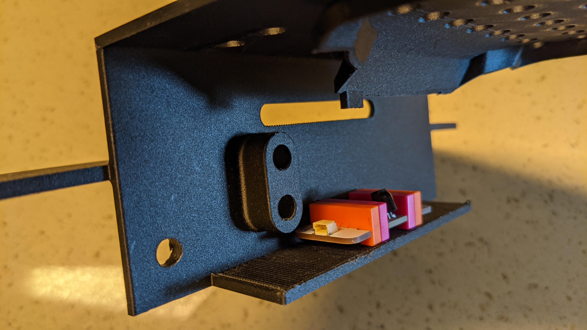
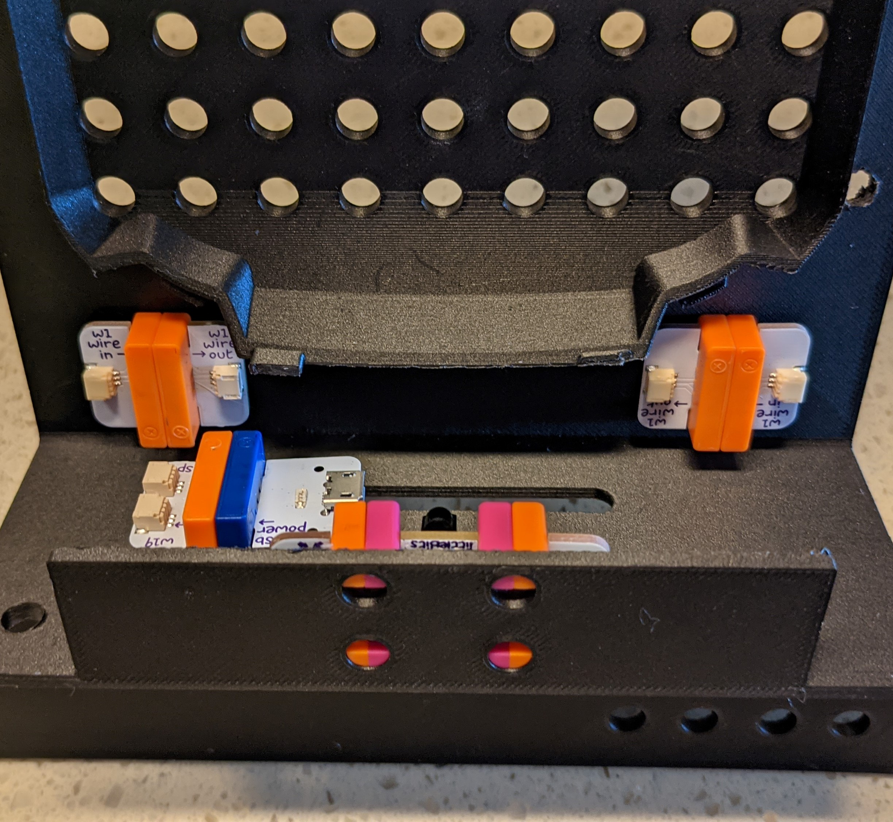
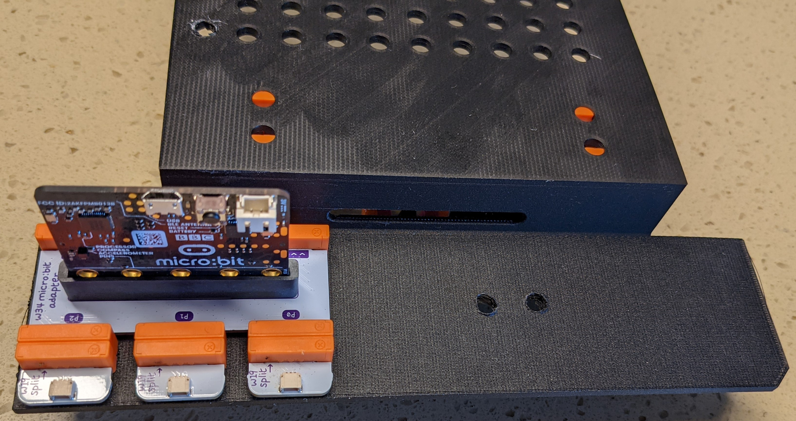
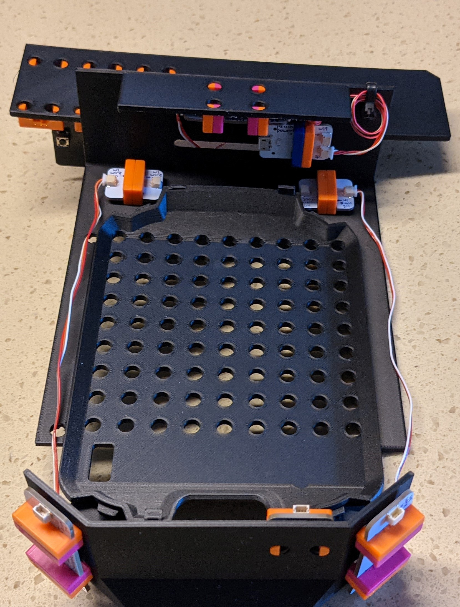

In preparation for Phase II, we need to modify a Sphero RVR with some littleBits,
and program it to avoid obstacles. This section will guide you through the process.

First, let's take a look at the finished product.

To assemble this, you will need to gather the following:

- littleBits components
  - micro:bit adapter
  - USB split cable
  - p3 usb power bit
  - i7 remote trigger
  - (2) i8 proximity sensor bit
  - (5) w1 wire in bit
  - (5) w1 wire out bit
  - (4) w19 split bit (single connector)
  - (2) w19 split bit (dual connector)
  - 9 wires
- micro:bit
- Sphero RVR
- 3D printed RVR topper (STL's for printing available [here](https://github.com/bellflight/VRC-2022/tree/main/3DPrints/RVRTopper). Please note, these files were exported in inches, not millimeters)
- zip ties
- tape
- drill (optional)
- .250" drill bit (optional)
- hot glue gun (optional)

To assemble the vehicle, we'll install all the individual
bits into the RVR topper, then connect the wires between them.

## Step 0

Obviously the first thing you need to do is print the RVR topper!
Again, the files can be found on GitHub
[here](https://github.com/bellflight/VRC-2022/tree/main/3DPrints/RVRTopper).
The file is modeled in inches,
so make sure it's the correct size when you print it. For reference, the overall
length is ~11 inches. Be careful when removing the support as you don't want to
break off the mounting tabs that interface with the RVR.

Your 3D printer may not be large enough to print the entire RVR Topper at one time.
n that case, you should print the three individual sections
(front, mid, and rear) and glue them together (super glue typically works well!)
In addition, if you'd like to split the file differently for printing,
the .stp file is also available
[here](https://github.com/bellflight/VRC-2022/tree/main/3DPrints/RVRTopper/RVR_Topper.stp)
so you can split it as needed.

The mounting holes for the littleBits and the grid pattern on top are 0.250"
diameter holes. 3D printers often will ovalize holes.
If that's the case, you can use a .250" drill bit to clean up the holes.

The pictures and documentation below were created with an earlier
iteration of the _RVR topper_. Accordingly, the _RVR topper_ you have will be
slightly different. They are similar enough, however, that
this shouldn't cause any confusion.

## Step 1

OK now that we have the RVR topper printed, lets start putting all the pieces together.
We'll start by installing the two proximity sensors on the front bumper.
Grab the two _i8 proximity sensor_ bits, 2 _w1 wire in_ bits, and two _w1 wire out_
bits and snap the wire bits onto the proximity sensors. Next, push the mounting posts
into the holes on the _RVR topper_. Be sure the _w1 wire out_ bits are on top!
Your assembly should now look like this:

## Step 2

Now we'll install a splitter inside the front of the bumper.
Snap together a _w19 split bit (single connector)_ and
a _w19 split bit (dual connector)_ and push them into the mounting
holes on the inside of the front bumper. Make sure the dual connector bit is on top.
Your assembly should look like this:

## Step 3

Now we'll turn our attention to the rear of the _RVR topper_.
Snap a _w1 wire in_ and a _w1 wire out_ onto the sides of the
_i7 remote trigger_ bit. This is installed onto the lower surface
inside the rear bumper. The w1 wire in should be on the right-hand side of the
assembly and the _w1 wire out_ should be on the left-hand side of the assembly.
Make sure the sensor is facing the RVR when installed! See the image
below for reference.

## Step 4

Next up is the p3 usb power bit. Attach a _w19 split bit_ (dual connector)
to the p3 usb power bit and install them onto the mounting boss inside the
rear bumper. The USB connector should be on the left-hand side of the assembly.
Now your assembly should look like this:

## Step 5

Now we'll install two inline connectors. Grab two _w1 wire in_ bits and two
_w1 wire out_ bits and connect them together. They are installed upside down
inside the rear bumper. The _w1 wire in_ bits should be facing outward like
in the picture below.

## Step 6

Now it's time to install the brains of the operation -
the micro:bit! Slide the _micro:bit_ into the _micro-bit adapter bit_.
It can physically be installed in both orientations, so look at the picture
below to make sure you've got it right! Then connect three of the
_w19 split (single connector)_ bits to ports P0, P1, and P2.
The micro-bit assembly should be installed onto the rear bumper.
Your assembly should look like the picture below.

## Step 7

Now that all the littleBits are installed, it's time to install the wires.
Some of the bits are easy to plug wires into, but some of them you may have to
temporarily remove from the _RVR topper_ for better access. Just be sure to re-install
them in the same orientation! The first one we will wire is the _i7 remote trigger_ bit.
Install a wire from the lower connector of the p3 usb power bit assembly
down to the _i7 remote trigger_ assembly. Coil up the loose wire and use a ziptie
to secure it. Then route another wire from the other side of the _i7 remote trigger_
assembly through the slot in the bumper and plug it into the P2 port of the
micro-bit assembly. Make sure your assembly matches the pictures below.

## Step 8

Now we'll wire up the proximity sensors. Plug wires into the _w1 wire out_ bits of
the proximity sensor assemblies and route them towards the back of the
_RVR topper_, underneath the sides, and plug them in to the _w1 wire in_
bits of the inline connectors.

Now connect a wire to the right-hand inline connector and pass
it through the slot, and plug it in to port P1 on the _micro:bit_ adapter.

We'll do the same thing with the other inline connector,
except this time it will be plugged in to port P0.

You can use a zip tie to tidy up these wires.

To finish wiring the proximity sensors, connect two wires from the front
splitter assembly to the lower connectors on the proximity sensor assemblies.
It doesn't matter which connector of the dual connector is connected to each
proximity sensor assembly. Again, secure the wires with a zip tie.

## Step 9

You probably noticed that the front splitter still has an empty connector.
That will be the last connection made, after the _RVR topper_ is installed on the RVR.
But in the meantime, we can connect the other end of that wire to the
splitter in the rear. One end will be connected to the splitter and the
other end will be free for now.

## Step 10

Now it's time to connect the _USB split cable_. The large USB-A connector goes
in the rectangular cutout on the top of the _RVR topper_. The other end is split.
The connector with the white stripe is plugged into the _micro-bit_, and the connector
without the white strip is plugged into the _p3 usb power_ bit. Use a couple of zip
ties to secure the wires along the edge of the _RVR topper_.

## Step 11

The assembled _RVR topper_ is ready to be installed to the _RVR_ itself.
There's a plastic cover over the USB plug on the rover. Be sure to
rotate this out of the way before installing the _RVR topper_.

To install the _RVR topper_, insert the rear mounting tabs into the slots
on the RVR, then lower the front of the _RVR topper_ into place. The front
mounting tabs will lock into the front slots. Plug the USB-A connector into the _RVR_.
To remove the _RVR topper_, push the blue button on the RVR and then rotate and
lift the _RVR topper_ off.

## Step 12

Last but not least, remember that free wire from earlier? It's time to route it.
It runs along the bottom of the _RVR_ and plugs in to the front splitter.

We recommend securing this wire with some tape on the bottom of the RVR as shown below.

Congrats! You have a fully assembled RVR. Now it's time to program it!

In the meantime, here are a few things we recommend:

- Double check all wires are secure and clear of the _RVR_ tracks.
- Paint it! Phase II is a search and rescue mission. We hope you'll be inspired to
  give your RVR a cool paint job - maybe some camouflage, or a medical theme,
  or even your school's mascot and colors!
- All the littleBits are press-fit into the plastic. Once you've confirmed it's
  working correctly, you can use some hot glue on the mounting pegs to make sure
  nothing comes loose during operation. We recommend waiting until after the _RVR_
  is programmed and tested before doing this.
