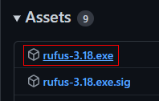
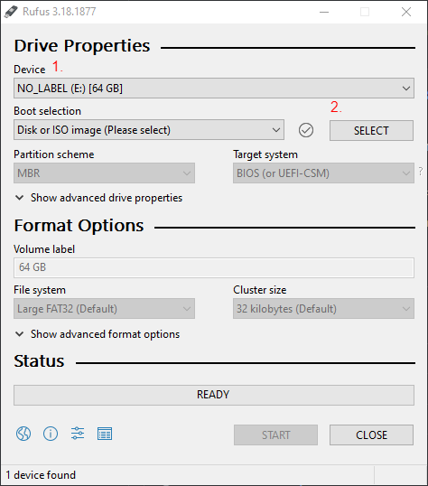
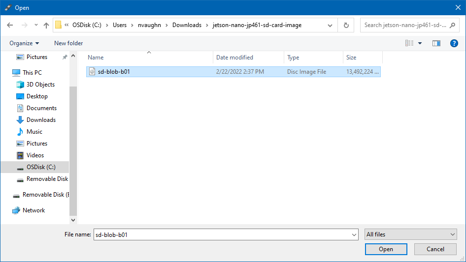
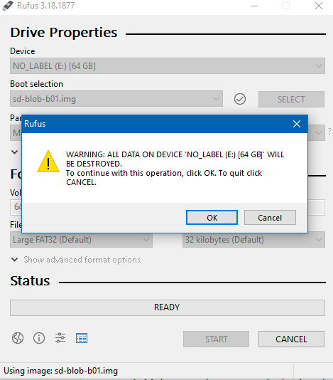
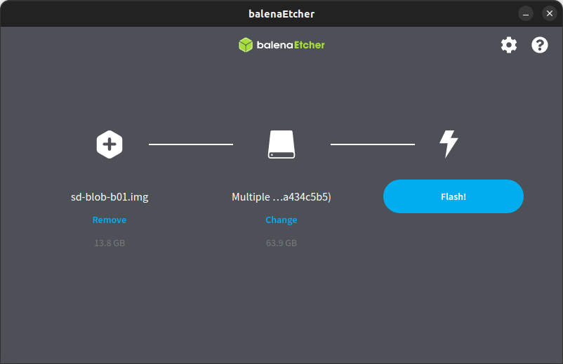
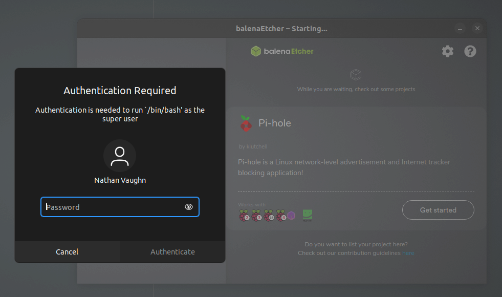

{}
Your Jetson should already have the operating system installed and configured for you.
These instructions are provided in case you need to wipe your Jetson and start fresh.
{}

First, you need to download the Jetson's operating system. The file you want is
[jetson-nano-jp461-sd-card-image.zip](https://developer.nvidia.com/embedded/l4t/r32_release_v7.1/jp_4.6.1_b110_sd_card/jeston_nano/jetson-nano-jp461-sd-card-image.zip).
For reference, this is the latest "Jetson Nano Developer Kit SD Card Image" from
[Nvidia's website](https://developer.nvidia.com/embedded/downloads).
This is a large file, so it will take a while.

After the `.zip` file finishes downloading, extract this file, and plug in your
microSD card.

## Windows

To flash the SD card on Windows, we recommend a tool called Rufus.
Go to [this page](https://github.com/pbatard/rufus/releases/latest) and download
the `rufus-<version>.exe` file.

Go ahead and launch Rufus.
When you launch the application, it should look something like this:

1. Make sure the correct device is selected. If your microSD card is not blank,
   it will probably have a different label.
2. Select the `.img` file in the folder you extracted.

You will now be able to click the "START" button in Rufus. Go ahead and click this.
You will get a number of warnings that you're about to format and wipe this
microSD card.

Go ahead and click through all of these, you know what you're doing.
Rufus will begin flashing the microSD card and at the end will let you know
when it's finished.

## MacOS/Linux

To flash the SD card on MacOS or Linux, we recommend using Balena Etcher.
Go to [their website](https://www.balena.io/etcher/) and follow
the instructions to download and install Balena Etcher.

Go ahead and launch Balena Etcher.
Select the `.img` file in the folder you extracted, and select your microSD card.

Once you hit "Flash", you may be prompted to enter your password
for super user privileges.

Balena Etcher will begin flashing the microSD card and at the end will let you know
when it's finished.
