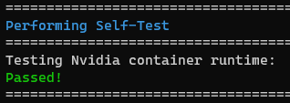

## Internet

In order to install the AVR software, your Jetson needs to have an internet connection.
The easiest way by far is if you have ethernet available. If so, just plug
an ethernet cable into your Jetson and you should be good to go.

If you don't have ethernet, you can use a WiFi connection. First, you can list
the available networks with:

```bash
nmcli device wifi list
```

Example:


Hit <kbd>q</kbd> to exit the list.

If the Jetson is already connected to a WiFi network, you can disconnect it with:

```bash
sudo nmcli device disconnect wlan0
```

To connect to a WiFi network, run:

```bash
# with a password
sudo nmcli device wifi connect <network name> password <password>

# without a password
sudo nmcli device wifi connect <network name>
```

such as:

```bash
sudo nmcli device wifi connect "WI do drones FI" password "Flying_Is_Fun"
```

If your network name or password has a space or other special characters,
you'll need to wrap it in quotes as shown above.

## Install

```bash
git clone --recurse-submodules https://github.com/bellflight/AVR-2022 ~/AVR-2022
cd ~/AVR-2022/VMC/scripts
chmod +x setup.py
./setup.py
```

This clones the software repo, changes directory into the repo you
just cloned, makes the setup script executable,
and then executes the setup script.


This setup script will automatically install and configure
everything needed on your Jetson to get it ready for competition.
This script does do operating system updates, so depending on your
internet connection, it may take a while to run.

At the end of the setup script, it will perform a few self-tests
to make sure everything is configured properly.



Once this is done, please restart your Jetson. Some system settings were changed
that require a reboot to take effect.


After this, you should be ok to continue on with the setup per the updating per
[Updating VMC Software]()
