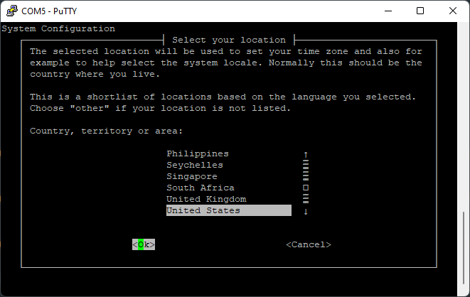

{}
Your Jetson should already have the operating system installed and configured for you.
These instructions are provided in case you need to wipe your Jetson and start fresh.
{}

## Initial Setup

{}
If using a serial connection, all the navigation here on out will be done via your
keyboard. Use the arrow keys and <kbd>Tab</kbd> to move the cursor,
and <kbd>Enter</kbd> to confirm options.
{}

Select "Ok"

Scroll through agreement and select "Ok"

Select your language

Select your country

Select your timezone

Allow clock to be set to UTC

## Creating your account

Enter a name, such as your school's name

Choose a username, such as "avr"

Choose a password

Retype your chosen password

When asked about resizing the partition, leave the default.

## Network Configuration

Setting up a network connection is not needed at this time. To bypass this, select
"dummy0" and let the autoconfiguration fail.

Go ahead and select "Do not configure the network at this time".

## Final Setup

Select an appropriate [hostname](https://xkcd.com/910/) for your Jetson.
"drone" is a good choice.

Choose the "MAXN" power mode.

Let the installation finish. Once it's done, reboot your Jetson.
