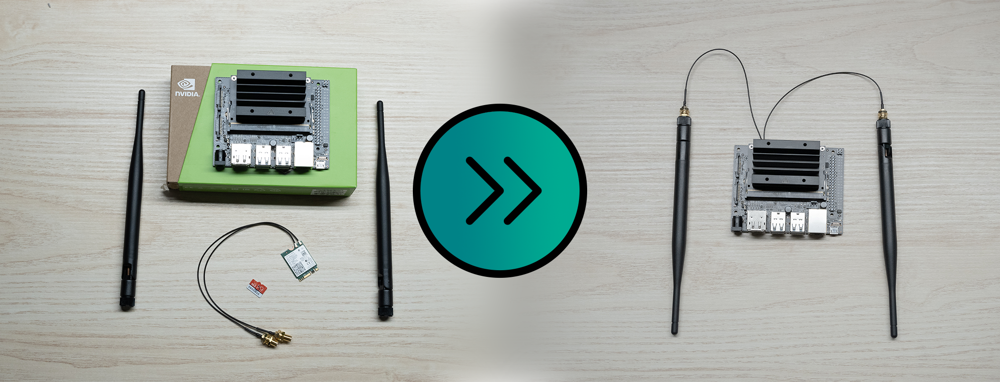
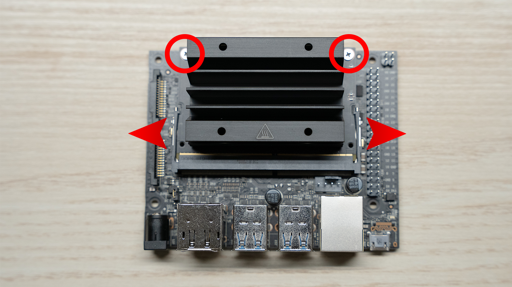
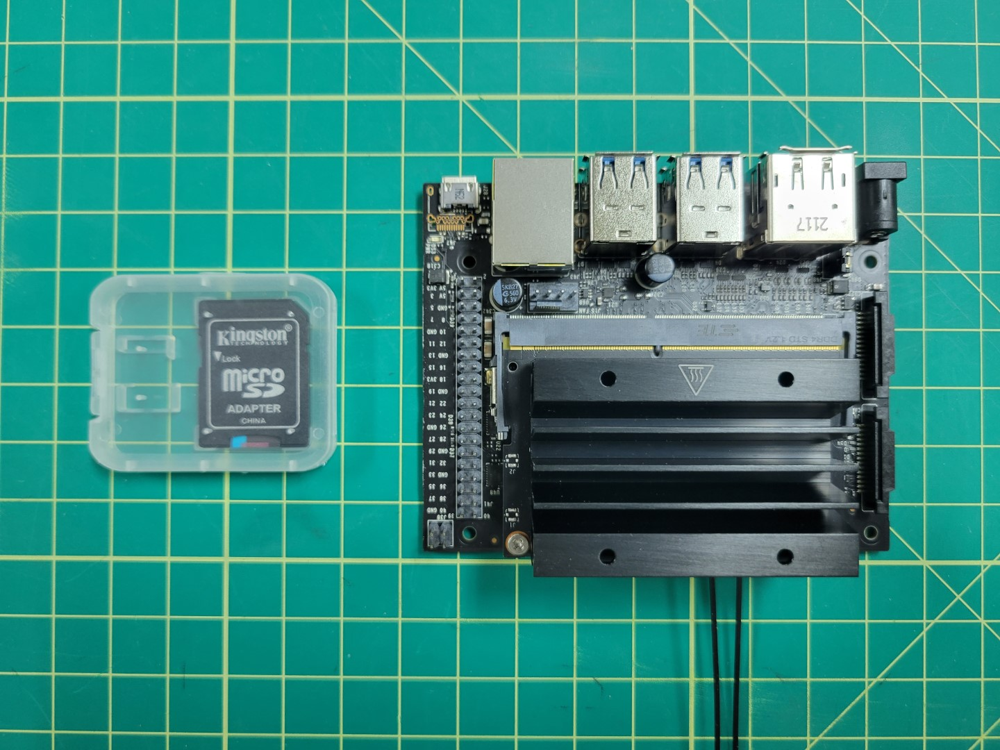
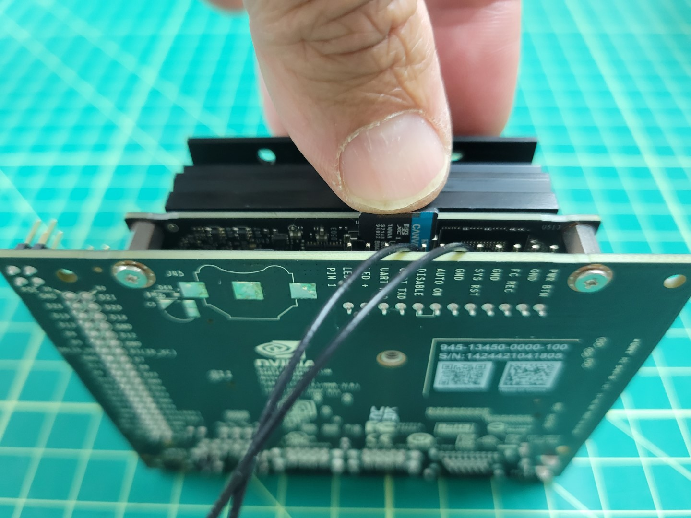

{}
The initial team kit included an incorrect variation of the
[U.FL to SMA Wifi cable](https://m.media-amazon.com/images/W/WEBP_402378-T2/images/I/61uj0TTCQ5L._AC_SL1500_.jpg).
Teams will be receiving a replacement set of cables in their Wave 2 kit shipments.
See [this post](https://www.bellavrforum.org/t/team-update-9-1-2022/81)
on the Bell AVR Forum for more information.
{}

- Unbox your Jetson
- Unbox WiFi Adapter
- Unscrew Jetson top
- Push the tabs out

- Pull out the Jetson Nano Module
- Pull black screw

- Slide in the WiFi card
- Put in black screw
- Slide module back into place
- Replace screws

{}
Now that your Jetson assembly is complete, please be sure to insert the micro SD card. The micro SD card contains Ubuntu (Linux) and the default VMC software pre-installed.
{}

Make note of the orientation of the micro SD card in the photo below.

