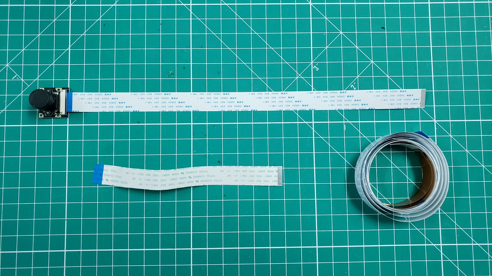
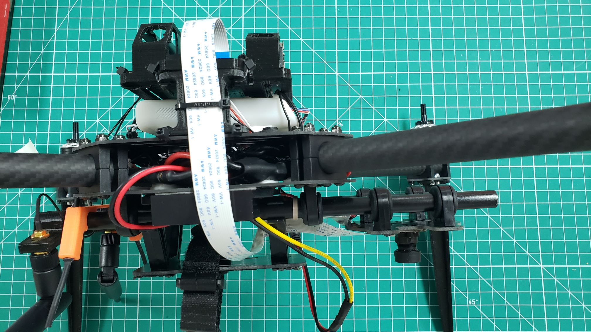

In this section you will attach the CSI camera to the bottom of the VRC drone
and connect it to the VMC using a ribbon cable.
CSI stands for **Camera Serial Interface** and is an industry standard that makes
it easy to communicate with a host processor, in our case the VMC.

The CSI camera is instrumental in Phase II for identifying April Tags and
assisting with the position hold flight mode. It's important that this camera
is mounted in the correct location and orientation. You can locate the camera
and ribbon cables in **Box 7** of your VRC kit.

While the CSI camera comes with a ribbon cable, it is too short to reach the VMC.
In the ribbon cable bag be sure to locate the 12" cable as shown below.

Removing the existing ribbon cable is easy. Pinch each side of the black
connector where the cable attaches to the camera and pull down gently.
The connector should slide down a few millimeters and the ribbon cable can be removed.

Slide the 12" ribbon cable into the connector with the printed text on the cable
facing upward as shown in the photo below. Pinch the black connector and push
upward until it is flush against the white housing. This will lock the ribbon
cable into place.

The next step is to attach the CSI camera to the bottom of your
VRC drone's camera mount. The camera mount can seen below and hangs
off the rails on the front of your VRC drone. Using double-sided mounting
tape you can cut a small piece that will fit onto the back of the camera
board. Secure the camera to the center of the camera mount.

{}
Camera orientation is very important for this step.
Make sure your ribbon cable faces the rear of the VRC drone frame as shown below.
{}

Feed the ribbon cable through the top of the battery tray and out the
right side of the drone frame. This will allow the cable to stay out of
the way of the battery and other components beneath the frame.

Connect the other end of the ribbon cable to the camera port on the
VMC as shown below. The connector is identical to the connector on the camera.
Make sure the labeling on the ribbon cable is facing outward.

{}
To keep your build clean and avoid any issues with cable slack we
recommend a zip tie to secure the cable to the VMC block.
{}

