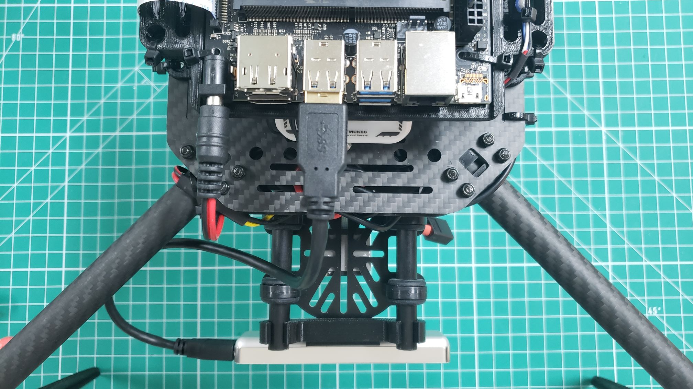

The Intel T-265 will be mounted to the front of your VRC drone and
connected with a USB cable. This camera is instrumental in mapping out
the environment in real-time and providing location updates to the VMC.
This enables your VRC to "see" and maintain it's current position without GPS!

The T-265 and replacement USB cable are located in Box 7 of your VRC kit.
The standard blue cable that ships with the T-265 is too long and cumbersome
to work with, therefore we've provided a much shorter one.

You should have printed the
[T-265 mount from the pre-requisites section]()
of this documentation. The 3D printed mount will attach to the
back of the T-265 using two M3 screws.

The photo below shows the replacement cable you should use with your T-265.

After attaching the T-265 to the 3D printed mount you will slide it
onto the front rails of your VRC drone. This will sit in front of the
camera mount used to hold your CSI camera.

{}
If you feel that the 3D printed mount slides too easily we recommend
adding a zip tie around each rail. This will keep the mount from
sliding forward and falling off.
{}

Finally, you can plug the USB cable into the side of the T-265
and into one of the ports on the VMC.

{}
As you're going through the build process make note of any cables that may
obstruct the drone's propellers. The photos provided throughout this documentation
show how we've mounted things and provide an sufficient amount of clearance.
{}

