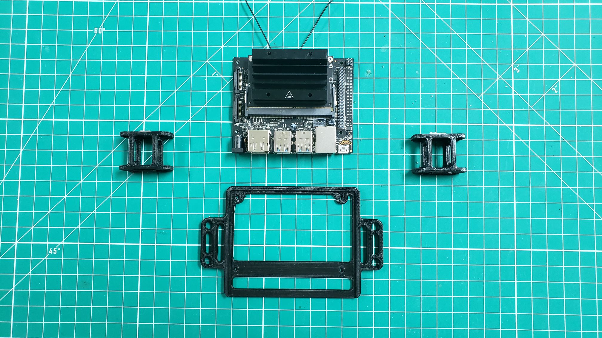
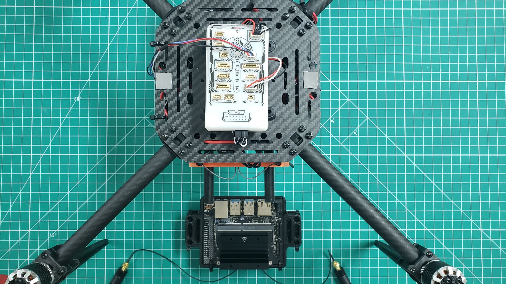

## Mounting

We will now mount the VMC using the
[3D printed components]()
overed in the pre-requisites section.
This includes the VMC mounting blocks and case.
The VMC is the "brains" behind your VRC drone build and will be responsible
for running the Bell software stack during testing and on competition day.

Go ahead and secure your VMC in the 3D printed case using zip ties as seen below.

With the VMC fasted into the mount the next step is to attach the
mount to the blocks. These blocks will provide enough clearance for
the VMC to rest above the FC. The blocks can be attached with zip ties
as well. The photo below shows one of the blocks attached and the
orientation of the other block before attaching.

After attaching the blocks with zip ties your 3D printed VMC mount should
like the photo below.

The next step will be to attach the VMC mount to the drone frame.
The photo below shows the orientation relative to the drone frame.
Notice that the USB ports of the VMC are facing the front of the frame
and the WiFi antennas are facing the rear.

The VMC blocks will attach to the two holes on the right and left of
the frame with zip ties. This will position the VMC over the FC.
Make sure the telemetry cable is hanging off to the left side of the frame.

{}
For added security we recommend placing a small piece of double-sided
tape on each side of the drone frame in between the mounting holes as seen below.
{}

Secure the VMC mount directly over the holes on the left and right side
of the frame. The double-sided tape will make it easy to place the mount
into position and then secure with zip ties.

At this point you can go ahead and connect the 2x20 crimp housing
and barrel plug into the VMC as shown in the photo below.

## Cooling

During advanced testing you will be running the VRC software stack on your VMC.
Since we make extensive use of the VMC's CPU and GPU it can heat up significantly.
It's important to keep your VMC cool and in this section you will install a cooling
fan onto the top of the VMC heat sink.

Place your cooling fan on top of the heat sink and insert all four bolts
through the fan and the heat sink. Using needle nose pliers you can hold
the nut into place and screw the bolt tight with a Phillips head screwdiver.

{}
The nuts provided with the cooling fan are not self-locking.
It's a good idea to check them from time to time or use a small amount
of thread locker to keep them secure.
{}

After mounting the cooling fan plug the connector into your VMC as shown below.

{}
The cooling fan automatically turns on to 100% when the VMC is powered on.
This functionality was installed as part of the VRC software, and helps
keep the VMC cool.
{}

