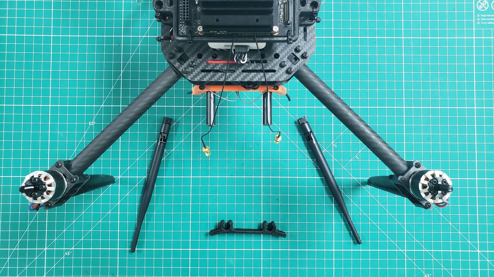
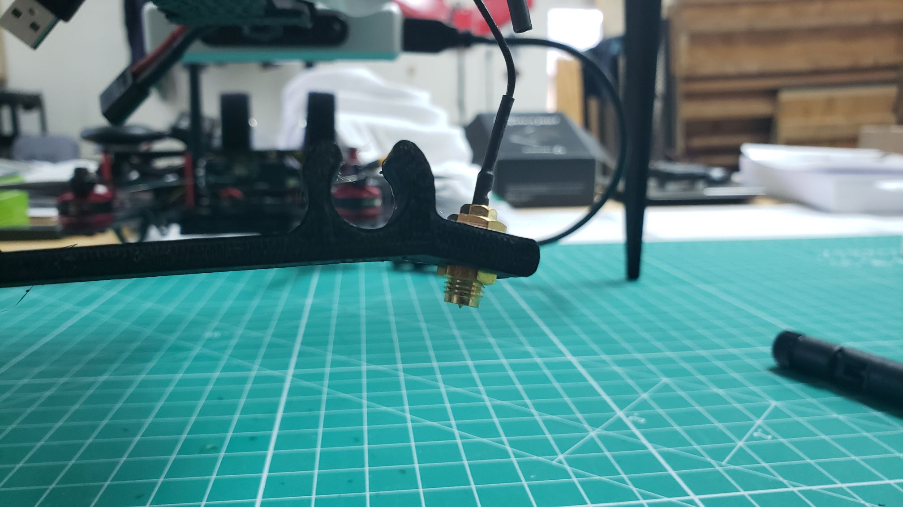

Before we covered how to
[attach the WiFi antennas to the VMC]().
These need to be mounted and secured so that during the competition you have a good
wireless link (2.4 GHz) between the ground station and the VMC.
This will allow for bidirectional communication between the ground station
and VRC drone connected to the same network. The WiFi antennas will be attached to the
[3D printed mount]()
covered earlier in the documentation.

The antenna mount will slide onto the rails that we previously used to attach the
[RC receiver]().
The easiest way to attach the antennas to the mount
is by placing one nut on top and one beneath the mount as shown below.
Tighten the nuts with a small pair of pliers so they don't come loose.

After securing the threaded connector to each side of the mount you can screw
the antennas onto each side. Tilt the antennas facing outward and slide the
mount onto the rails behind the RC receiver mount as show in the photo below.

