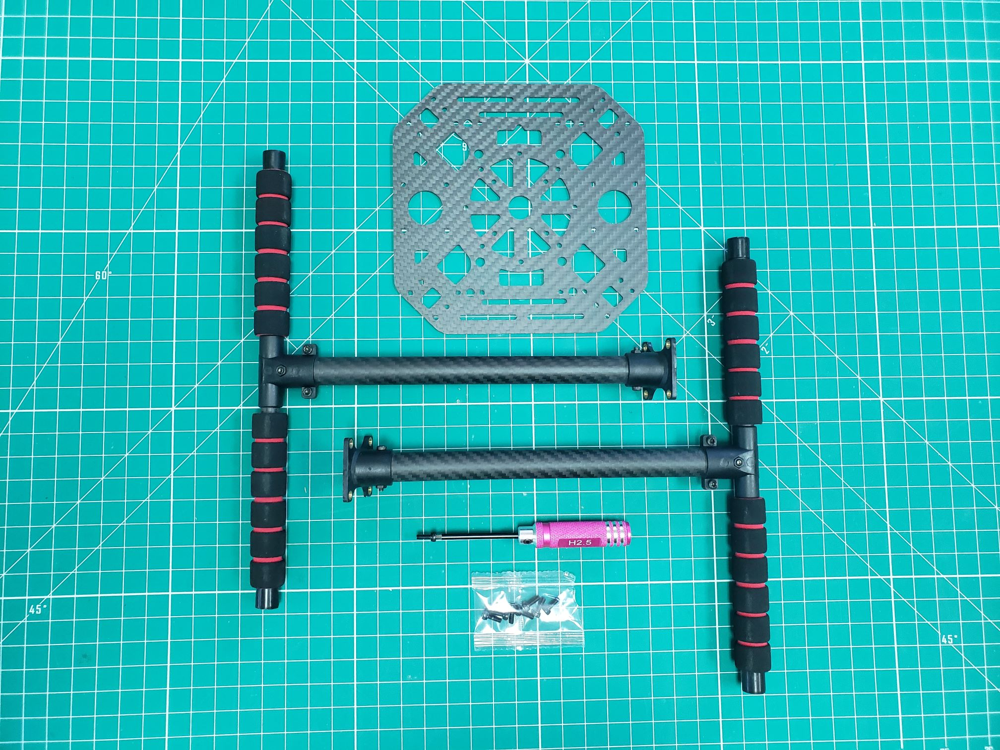
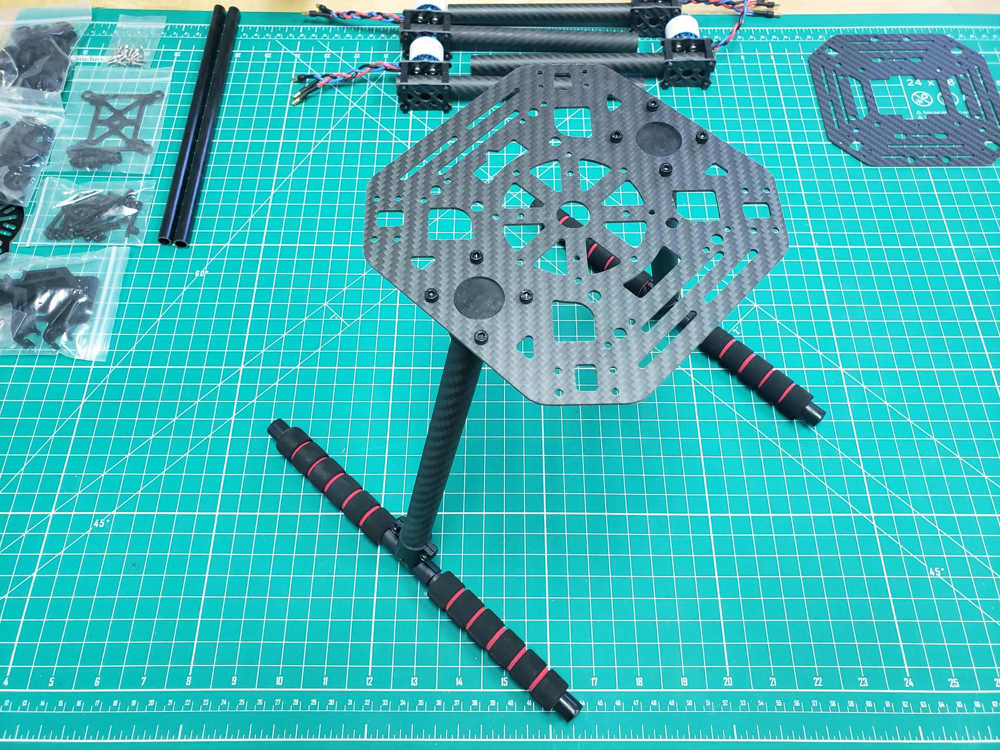
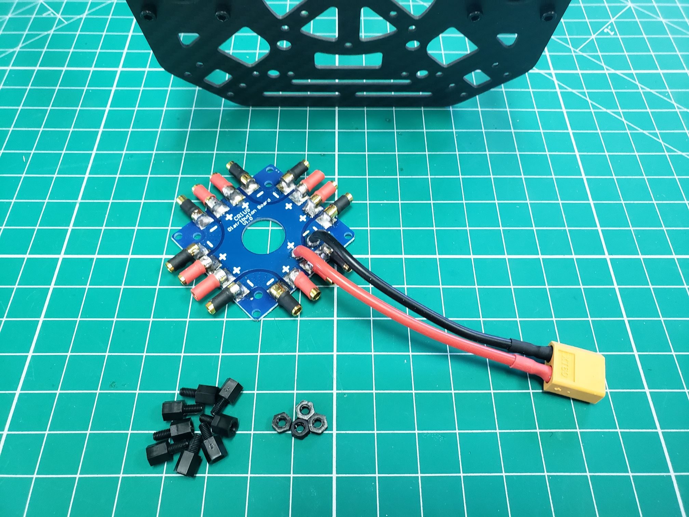
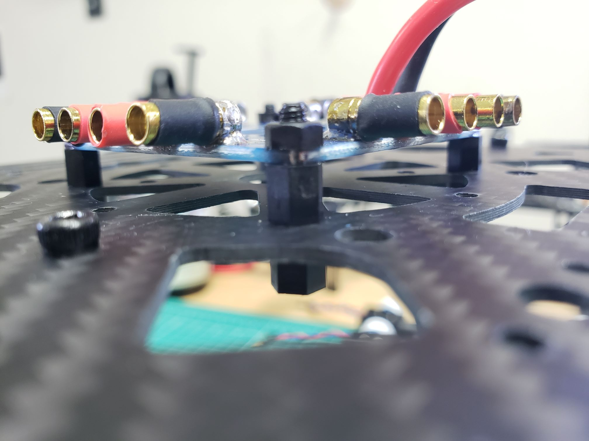
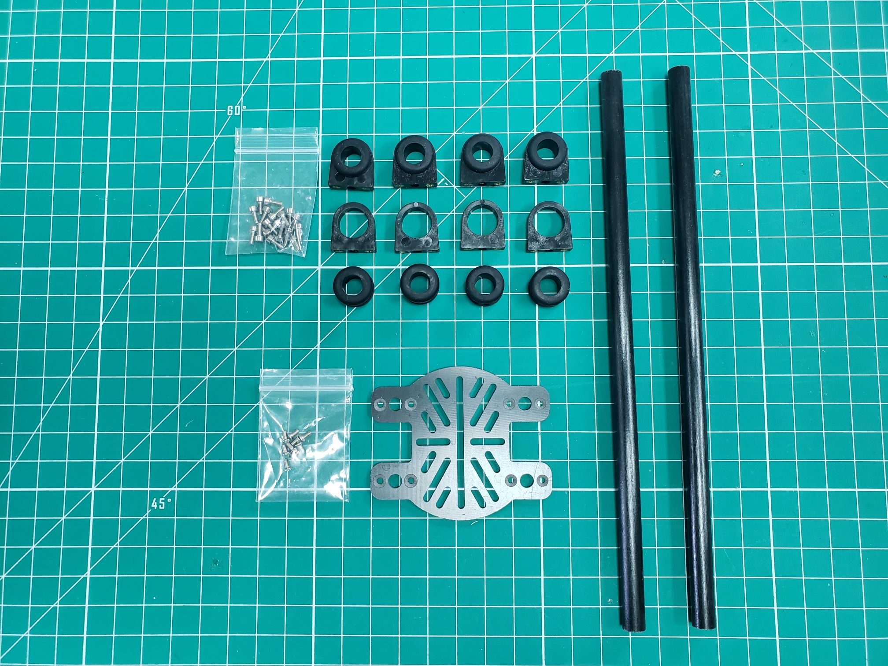

## Landing Gear

Each leg consists of two parts.
The first is the horizontal part with the T-connector and foam protection.
The second is the carbon fiber tube with the connector that can be mounted
to the frame.

Begin by loosening the two hex screws on the side of the T-connector with
the H2.5 tool. You should now be able to insert the carbon fiber tube.
Rotate the inserted tube so that the base legs (with foam) will be aligned
properly when the top connector (with four brass threaded inserts) is attached
to the bottom frame plate. Tighten both screws on the T-connector to hold the
leg in place. Do this for both legs.

{}
Be careful not to overtighten as the plastic T-connector
can easily crack with too much force.
{}

Next, we will need the bottom plate of the frame. It is one of the two plates with
the cutouts as shown above. The bottom plate is the one with the circle-shaped
holes in the middle and on the sides. Around the two circle-shaped holes on the
sides, there are four small holes for screws. The black M3 socket head cap screws
go down these holes and should screw directly into the leg mounts.
Nuts are not needed for this part.

{}
The T-connector is vulnerable to cracking with hard landings.
We have found that adding a zip tie around the connector can help protect it.
{}

## Power Distribution Board (PDB)

Next, we will install the PDB onto the bottom plate. You should have a
pre-soldered board included with your kit. This should be located in Box 4
(soft, black case). It already has bullet connectors for your ESCs.
It also has a yellow XT60 connector for the FC power module.

{}
The PDB is supplied and soldered by a 3rd party.
Some participants have noticed a white residue on the backside of the PDB.
This may be flux residue leftover from soldering. We recommend cleaning this
residue with alcohol first before installing in case this residue inadvertently
causes corrosion over time.
{}

There should be nylon spacers and nuts included with the PDB.
We will use these to mount the PDB on top of the bottom plate.

There are eight holes for screws distributed in a circle around
the center of the bottom plate. We will use the "diagonal" holes. These are the ones
that will allow the edges of PDB to be parallel with the edges of the bottom plate.

You will install the spacers as shown in the photo below. Place a spacer beneath
the bottom plate and another on top. Using your fingers you will be able to screw
them together. Do this for all four corners.

At this point you can place the PDB down on the spacers so the threads poke
through the corner holes. Now use the remaining four nuts to tightly
secure the PDB to the top spacers.

{}
Make sure to orient the PDB so that the yellow XT60 connector is
facing the rear of the frame. The photo below shows the front
of the frame with a small triangle etched in the cutout.
{}

You can place the XT60 connector through the rear frame hole.
In an upcoming section we'll be connecting the FC power module to
the XT60 connector of the PDB.

## Rails

The next step is installing the rails. Other plates and components can easily be
attached to them. The rails have a standard of 60 mm spacing with 10 mm carbon
fiber tubes, and you can find several 3D printable mounts which fit.
These rails will come in handy throughout VRC.

We need the two 10 mm carbon tubes, the two plastic bags with tube mounts and
rubber rings, and the small M2.5 screws. There is also a smaller carbon fiber
plate included, typically used for camera mounting, that we will put on these rails.

First, push the rubber rings into the tube mounts. This may take some force,
but it should be possible without the need for tools. Do this for all eight mounts.

Slide four tube mounts on each carbon tube, such that the screw holes in the
tube mounts align with the holes in the bottom plate of the drone.

We can now easily mount these to the bottom plate using the small
M2.5 socket head cap screws. The screws go down from the top and
should screw directly into the tube mounts. The extra tube mounts
for the small plate should be at the front of the drone.

Finally, you can mount the small plate to the tube mounts at the front of the frame.
You will need the M2.5 phillips-head screws.
This plate can be used to mount a camera, companion computer,
or any other accessory. More of this will be covered as you progress further into VRC.

{}
It might also be useful to apply a **threadlocking adhesive** (such as Loctite 243)
to the screws for the rails and connected plates. In any case make sure to check
the screws regularly, especially if you have any payload attached
to these rails (such as a camera module).
{}


