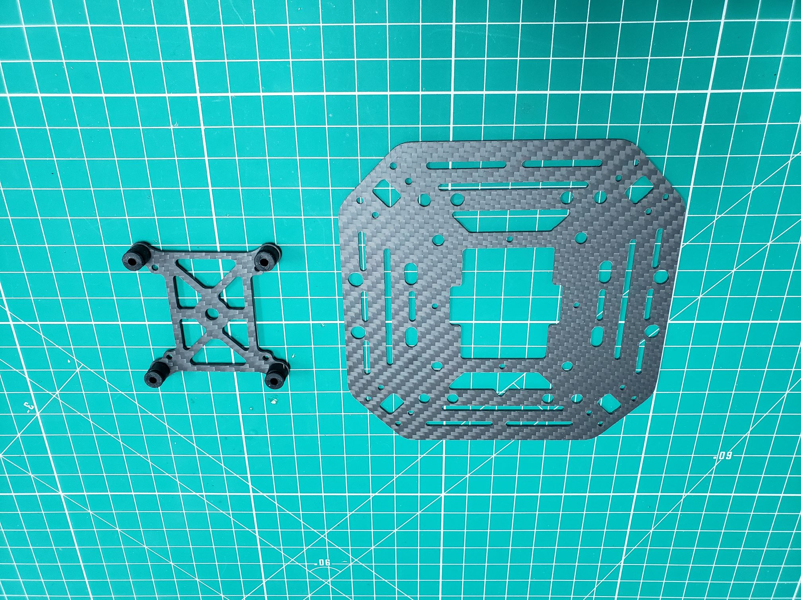
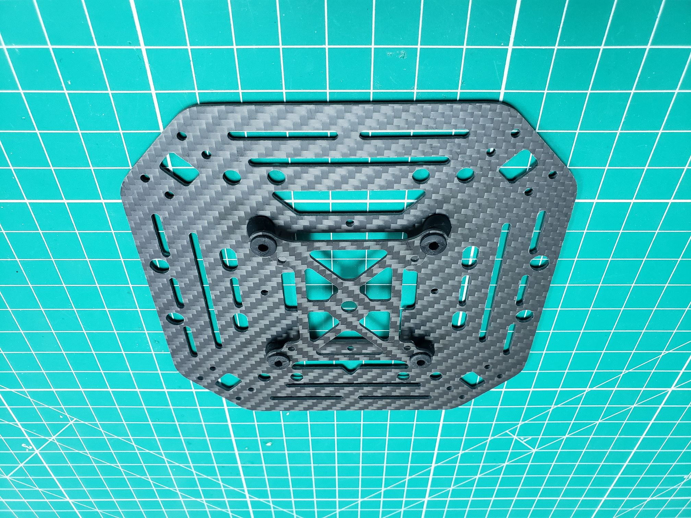
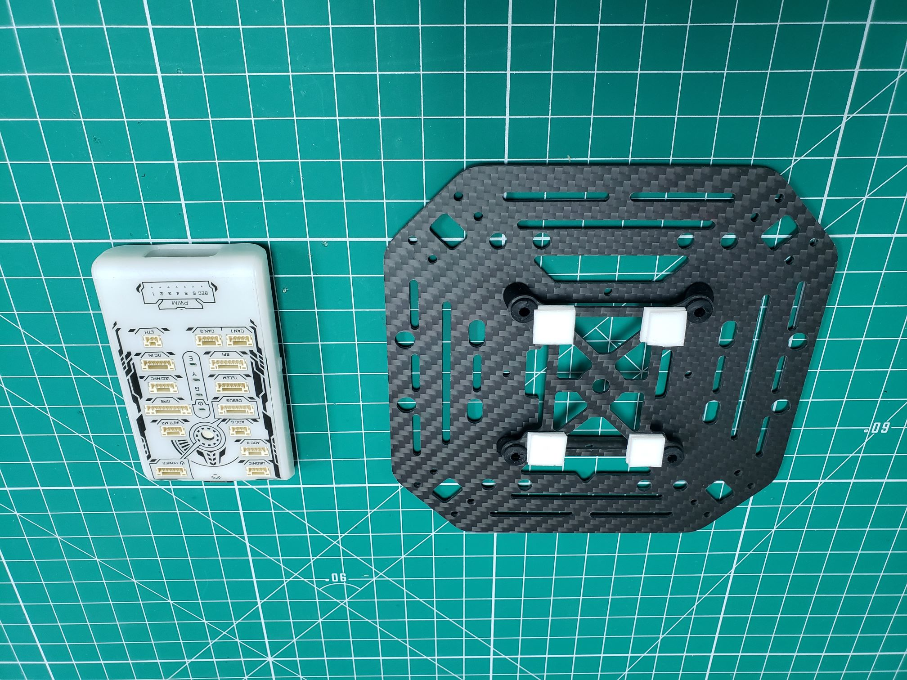

## Vibration Damped FC Mount

First, the FC mount should be assembled.
It's a small carbon fiber part and it should come with four black
vibration-damping rubbers. You should put these rubber dampers through
the corner holes of the mount as seen below.

The rubber dampers can be a challenge to work with.
**Don't hesitate to use force** and pinch them with your fingers to
push them through. You can also wet them a bit so they "glide" through the holes.

{}
If you continue to have problems one suggestion is to use the
side of the small hex tool to push the dampers into the holes.
Be sure to come at the damper from the side and do not poke directly into it.
{}

Now we will install the FC mount to the top plate of the frame. There are four similar
holes at the corners of the big gap in the middle of the top plate.
You should also put the rubber dampers through these holes, as shown below.
Note that they do not exactly align, there will be some tension on the rubbers.
This will help dampen the vibrations.

You may be wondering about all this vibration talk.
The reason for isolating the FC from vibrations can be best summed up with this quote:

> Flight Control boards with in-built accelerometers or gyros are
> sensitive to vibrations. High vibration levels can cause a range of problems,
> including reduced flight efficiency/performance, shorter flight times and increased
> vehicle wear-and-tear. In extreme cases vibration may lead to sensor
> clipping/failures, possibly resulting in estimation failures and fly-aways.

[https://docs.px4.io/v1.9.0/en/assembly/vibration_isolation.html](https://docs.px4.io/v1.9.0/en/assembly/vibration_isolation.html)

## Mounting the FC

You can mount the FC to the carbon fiber plate with some sticky tape.
Similar to how we previously mounted the ESCS, we recommend double-stacking
the tape as seen in the photo below.

{}
As we discussed previously, there is a little triangle cutout in the bottom and top
lates that represent the front of the frame. Be sure to mount the front of the
FC pointing to the front of the top plate as seen in the photo below.
The front of the FC is where the SD card is located and the rear has the
header pins (labeled PWM).
{}

