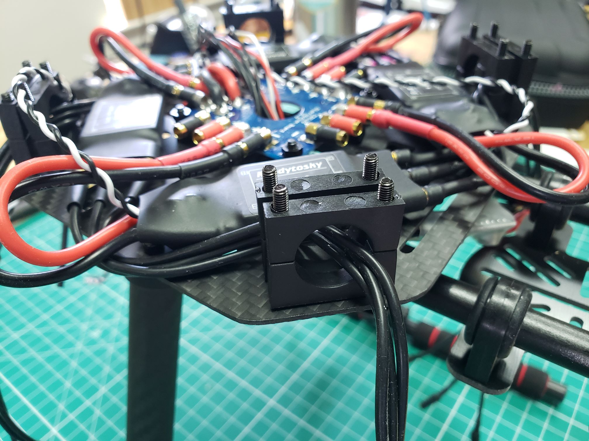
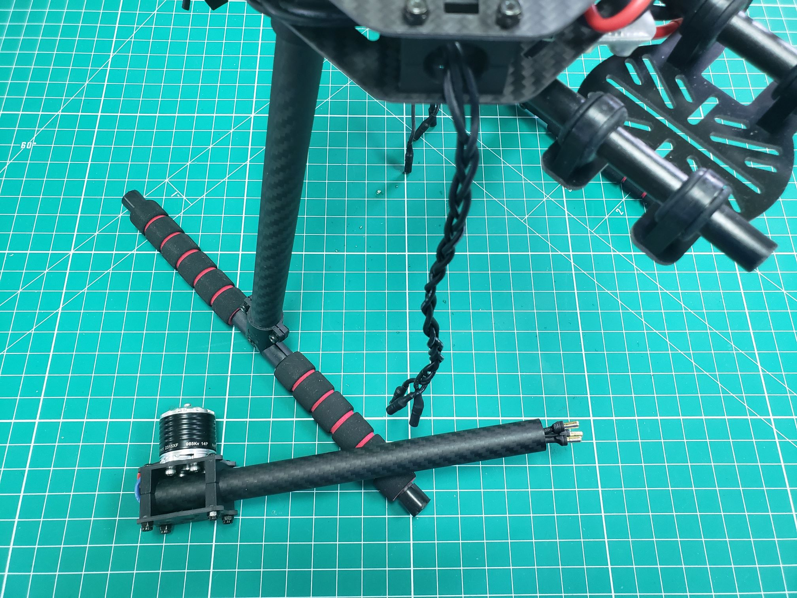
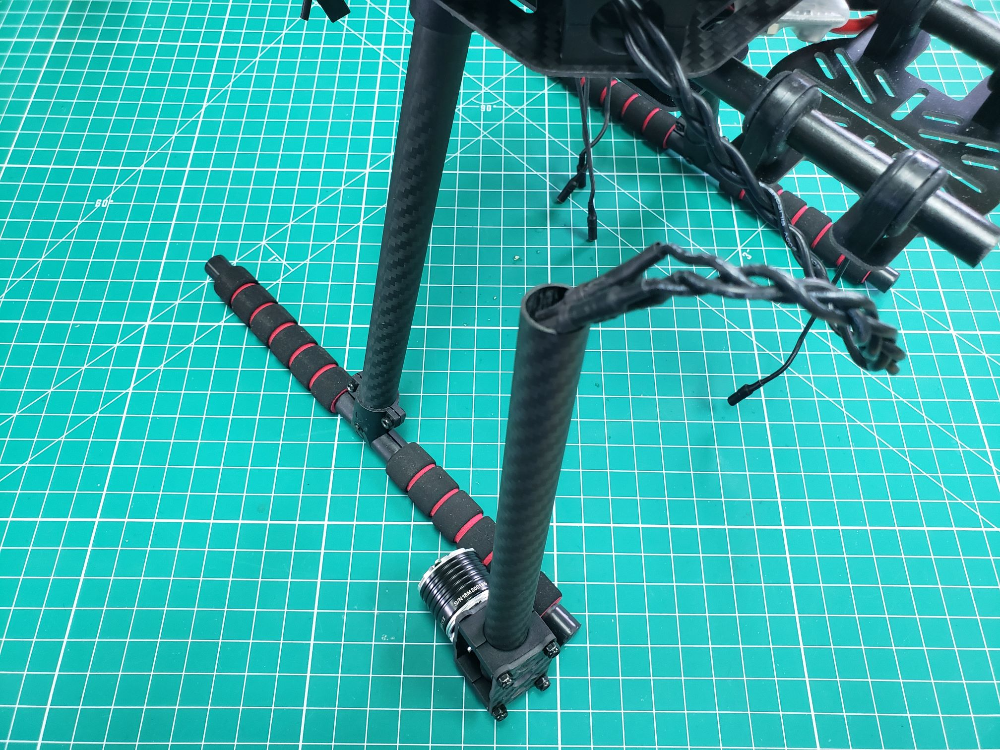
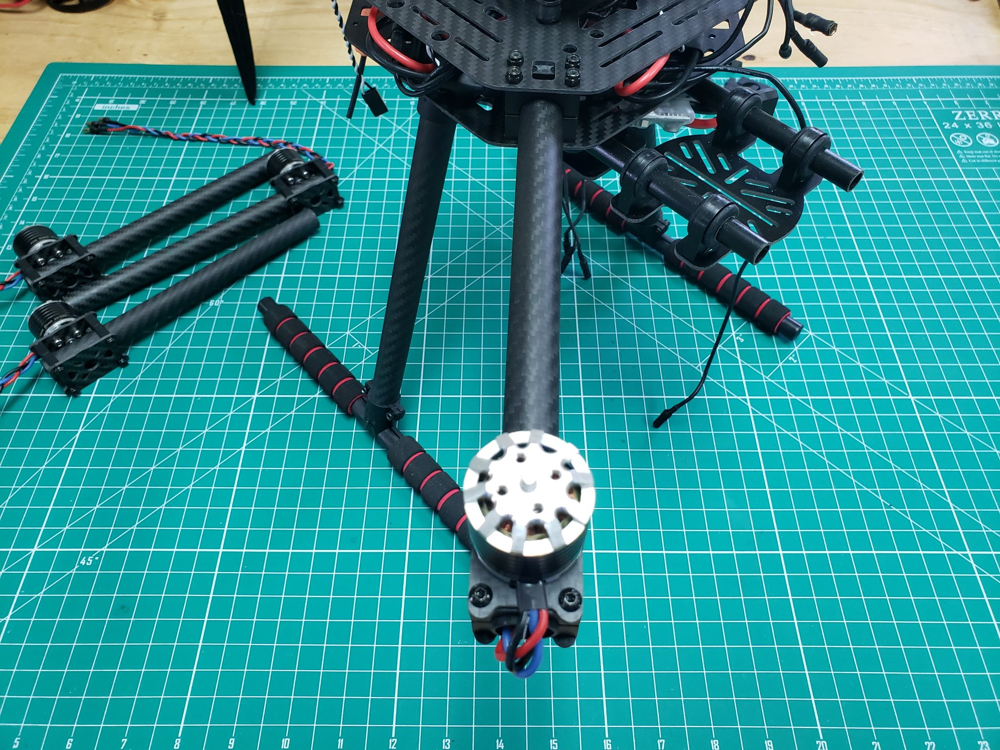

## Installing the Top Plate

We will first install the tube clamps on each corner of the bottom plate.
These will be used to "clamp" down on the motor arms and hold them securely in place.
Place four long, threaded bolts and tube clamps as shown in the photo below.

After placing the bolts and clamps on each corner of the bottom plate,
make sure you run the three ESC cables through each set of clamps.
We do this now because it will not be possible after we secure the top plate.
These cables will eventually feed through the carbon tubes and connect to
the motor leads.

The next step is to place the top plate on the bolts and tube clamps.
Make sure to place the top plate facing the correct direction.
This will become clear as you go through the rest of this section.

{}
Before you put the top plate on, it is convenient to pull all signal cables coming
from the ESCs (black and white) to the back. Pull them through the gap
in the top plate below the servo rail of the FC.
{}

{}
You should pull the two cables coming from the RC receiver and FC power module
through the gap underneath the FC, from the right side as seen in the photo above.
It will be a lot easier if you do this now as the cables will be
hard to access when the top plate is in place.
{}

With the top plate in place, **hand-tighten** four locknuts in each corner
of the frame. We recommend starting with one corner of the frame and working
your way around. Get the nuts tight enough so the bolts do not slip down.

{}
Be sure to double-check that no cables are pinched between the
top plate and tube clamps.
{}

## Installing the Motor Arms

In this section, we will install the motor arms into the tube clamps.
Take one of the arms and feed the motor cables into the tube all the way through
to the opposite end. The bullet connectors will barely extend beyond the
tube as seen in the photo below.

{}
You may notice in the following photos that we have braided
our motor and ESC extension cables. This is not necessary but does
help make managing all of the cables a bit easier.
{}

Now you will connect the male bullet connectors from the motor to the
female connectors of the ESC.

You may notice there is quite a bit of slack after connecting the cables,
but not to worry as you can feed it in between the top and bottom plates.
Slide the arm into the tube mounts while feeding any extra cable slack into the frame.

Make sure the carbon tube extends no more than 2 mm past the clamps and try to keep
this consistent for all four arms. Consistency is key as it provides for the most
stable flight. The photo below shows the carbon tube extending 2mm beyond
the interior tube clamps.

{}
Before you tighten each arm all the way down make sure the motor is not askew.
You want the motor shaft to be perpendicular to the frame (pointing straight up).
This is important as it will provide for the most stable and consistent flight.
{}

You can now tighten the bolts that go through the tube clamps using
the provided hex tool and socket wrench. Repeat this process for all four arms.

{}
After tightening all the tube clamps it is a good idea to go around one
more time to make sure the hex nuts are nice and tight.
{}

