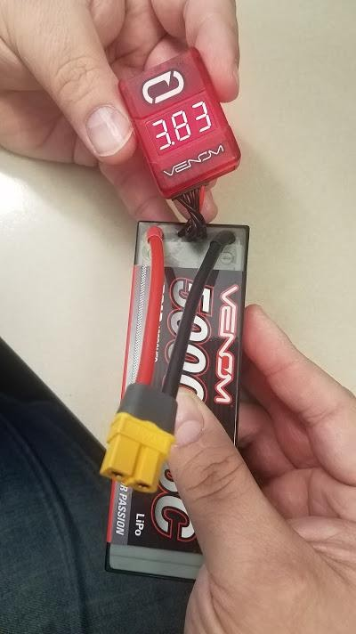

## Safety Overview

**Please ensure all team members have read the LiPO instruction sheet that was
included with the Venom battery as well as the manual for the Venom Pro 2 Charger.**

These documents can be viewed at:

- [Venom 15027 4S 5000mAh 35C Battery]()
- [Venom Pro 2 Charger]()

### Key Safety Points

- Always charge batteries using the proper settings.
  Improper charge settings may result in a catastrophic failure of the battery.
- Never charge batteries unattended. If, during a charge, you need to leave for
  any reason, stop the charge and disconnect the battery from the charger.
  You can restart charging when you return.
- If a battery ever becomes warm/hot during charge, or starts to swell, it
  should be removed from the charger and taken outside where it cannot cause
  damage if it fails. If a battery fails as a result of damage or misuse it
  may result in fire.
- Never leave a battery connected to your device or charger when not in active use.
  This may cause a parasitic draw on the battery which may lead it
  to become over-discharged.

### LiPO Battery Voltage Range

- 4.20V per cell represents a fully charged cell.
- 3.00V per cell is the very lowest the battery can go without sustaining damage.
- 3.70V per cell is the "Nominal Voltage" which is the "named" voltage of the cell.
  This voltage is used as a standard to identify the cell/battery type.
- 3.5-3.7V per cell is the voltage we would recommend landing at.

The battery you will be using is a Venom 14.8V 5000mAh 35C Battery.

### Definitions

- **Battery**: A battery is a device consisting of one or more electrochemical
  cells with external connections for powering electrical devices.
- **mAh**: is an abbreviation for milliamp hour and is a unit that measures
  (electric) power over time. It is commonly used to measure the energy capacity
  of a battery. In general, the more mAh and the longer the battery capacity or
  battery "run time."
- **C-Rating**: is a shorthand representation of how many amps the cells can
  supply on a continuous basis without failing.
- **Cell Count:** How many cells are in series to make the overall voltage of
  the pack. In this case, 4 cells are in series to make 14.8V nominal, or 16.8V
  when fully charged. Sometimes referred to as a 4S battery, the "S" refers to
  "series" to tell us how many cells are comprising the battery pack.

### The Charger: Venom 0677 (Pro 2)

The Venom Pro 2 is one of Venom’s most popular single-channel
multi-chemistry battery chargers. It features an 80W Power supply
as well as an integrated balancing port. The Pro 2 is capable of
charging 1S-6S batteries.

We recommend you use this pouch as a charging mat,
this will give you an added layer of protection between the battery and
the charging surface. Always remember to charge batteries on a
non-combustible surface.

### The Cell Checker: Venom 0644

This cell checker provides you with instant access to see the voltage of the
individual cells of your battery. It doubles as a low voltage alarm, but you
probably will not use it in that capacity. It will first show the overall pack
voltage, and then cycle through showing the voltage of each individual cell.

{}
When using the cell checker, you need to plug it in with the contacts
(silver tabs) facing up and (black plastic arrows facing down)
and the plug towards the left side of the checker.
{}
