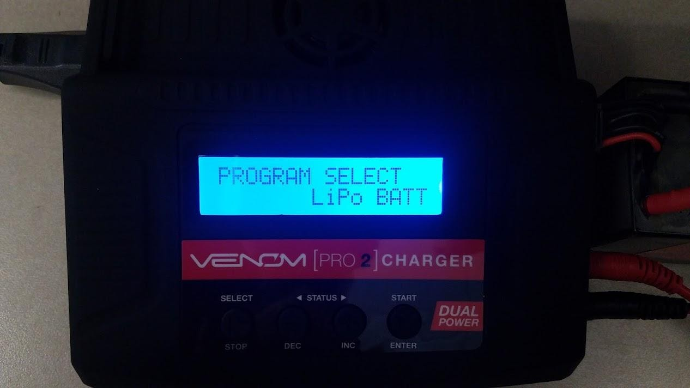
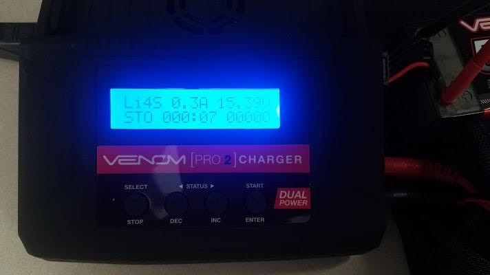

## Battery Storage

After using the battery, give it approximately 30 minutes to cool down.

Determine when the battery will be used going forward. If the battery will be used
again within 24 hours, proceed to fully charge the battery.
The goal is to minimize the time lithium batteries sit fully charged.
Long periods of maintaining full charge will dramatically reduce the lifespan
of the battery pack, and can lead to swelling/premature failure.

If the battery will not be used in the next 24-48 hours, please proceed with a
storage cycle, as seen below. Plug the battery into the charger using the same
steps from the charging section.

Press the SELECT button on the charger until you see the menu labeled
"Program Select-LiPo Batt." Then press, ENTER.

Press the INC button until the display reads, "LiPo Storage" then press Enter.
You will want to use this setting for each storage cycle.

Once the setting on your charger matches the setting shown above,
press and hold the START/ENTER button until the display reads,
"Battery check wait…". You can release the START/ENTER button at that point.

The charger will now ask you to confirm that the cell count it detects is the
same cell count that you entered.
R=Recognized (by the charger) S=Selected (by the user.)
Provided those values match, press ENTER to begin the storage process.

Once you have initiated the storage charge, you will see the
charge status screen pictured below.

**STO** in this case indicates that the charger is taking the battery
to a safe storage voltage. All other indicators are the same as when charging.

{}
Typically the charger will charge up to and past storage voltage.
It will then discharge in order to accurately hit the target storage voltage.
This is normal.
{}

When the charger finishes the storage cycle, it will indicate "END".
Disconnect the battery, it is now safe to store the battery for up
to 3 months in this state.

{}
Storage charging may take hours to perform properly based on the
starting voltage of the pack. A storage cycle should never be conducted
without direct supervision. In cases where the time for a proper storage
cycle cannot be committed, leave the battery in a discharged state rather
than taking a chance and leaving it unattended while on the storage cycle.
{}

The storage voltage range is typically between 3.70-3.85V per cell.
However, lower voltages, down to 3.4V per cell are unlikely to cause issues,
especially over shorter time periods. If the battery will be in storage for more
than a week, it’s best to perform a proper storage cycle as time permits.

Should you have any questions or concerns, please reach out to Venom Customer Service
at [1-800-705-0620](tel:1-800-705-0620) or by starting a support case at
[VenomPower.com](https://www.venompower.com/).
If you reach out, please let them know that you are using the battery as
part of Bell VRC.
