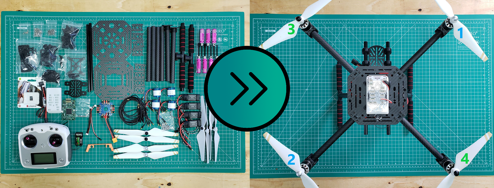
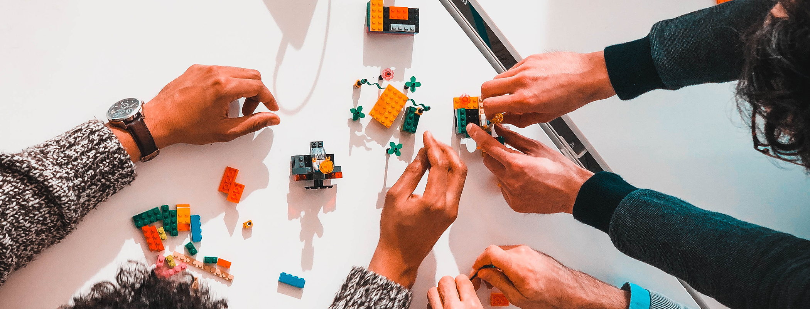

## Phase I Tasks

### Primary Goal

For the primary goal, the main idea is to get your base drone kit assembled
and in the air. Teams will have to assemble their drone from near scratch:
assembling the airframe, connecting flight control electronics, and
calibrating sensors are just a few of the things you'll run into when
completing the primary goal.

### Secondary Goal

For the secondary goal, teams will assemble a "Peripheral Control Computer" or
PCC in order to control various LEDs and servos for their drone.

### Overachievers Goal

For the overachievers' goal, it's all about getting your Vehicle Management
Computer, or VMC setup and running. We won't be doing much with it for Phase I,
but Phase II will be a whole different story. We'll go through the initial
setup of this tiny computer, install an operating system, and do some initial
tests to ensure it's ready for Phase II.

### 3D Printing Project

As part of Phase I of the VRC, all members of a team will work together as a
group to conceptualize, design, fabricate, assemble, and test a solution to
address needs around rotor safety and vehicle visibility.

