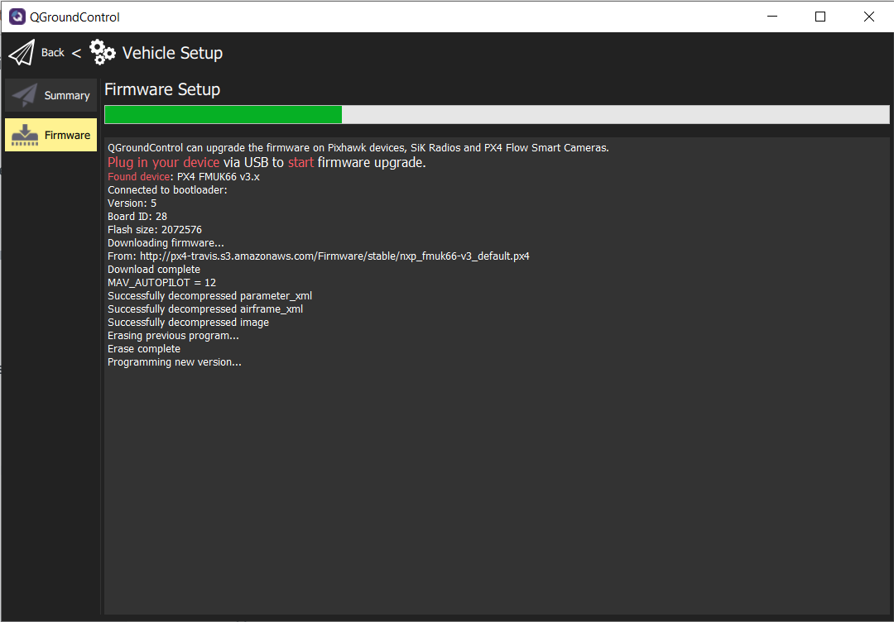

## Uploading PX4 firmware using QGC

[PX4](https://px4.io/) is the recommended firmware that we will be running 
on the VRC drone. It is an open-source flight stack containing all the 
software necessary to get your drone into the air. In Phase 2 of the 
competition we will introduce you to a modified version of PX4 
provided by the Bell team.

In the Firmware screen you can upload a new version of PX4. 
To access the firmware screen make sure to click on the Q logo in the 
top left of the screen and then click on **Vehicle Setup > Firmware**. 
You will see the following screen.

{}
Make your FC is **NOT** plugged in when accessing the firmware setup screen. 
First access the firmware screen and **THEN** plug in your FC. 
It will recognize the connection and initiate the process.
{}

QGC will ask you to plug in your FC using a USB cable. 
A popup will appear that asks you which firmware you want to use. 
We will use the **PX4 Pro Stable Release**. 

After clicking **OK** to upload PX4 to the FC you will see a progress bar. 
This process should take no more than 2-3 minutes.

After the PX4 firmware is successfully loaded you will be presented with
the default **Vehicle Setup** screen. It is necessary to go through the 
following steps to ensure a reliable and stable first flight.

