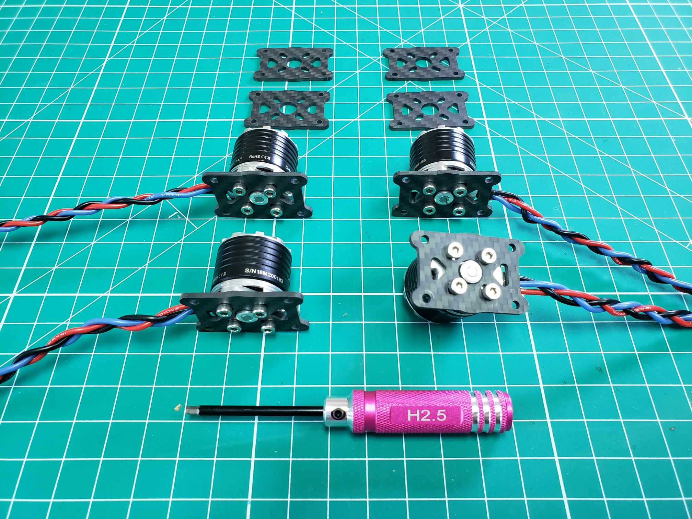

## Motor Mount Assembly

The four motor mounts go on the end of the arms (carbon fiber tubes).
Each one consists of two small carbon fiber plates, four tube clamps
(the arch-shaped parts), and four long M2.5 screws with locknuts
(with an elastic ring inside). Additionally, you need the motor itself and
four short, silver M3 screws contained in a small ziploc bag.

{}
**Be sure to use the right screws for motor mounting.
These screws are short and silver. They can be found in Box 4 (soft, black case).**
There are longer screws in the frame box (Box 1) that will fit into the motor,
but they should not be used. They are long enough to damage the motor windings.
The photo below shows the **shorter screws** that should be used.
{}

Go ahead and unbox your motors, but for now, we are only concerned with the
motors themselves. In an upcoming section, we will cover installing the prop
adapters and making sure your motor rotation is correct.

The first step is to mount the motors onto the small carbon plates.
You need a carbon plate and four M3 screws for this. Make sure the three
motor wires extend from the short sides of the carbon fiber plate.
Repeat this step until you have all four motors mounted. Make sure you
tighten the screws appropriately because it will be hard to access the screws later.

{}
Be careful to not overtighten the screws. They will come to a hard stop when
threaded all the way. If you try too hard you may end up stripping the head
of the screw. It's also a best practice to check the screws before each mission.
{}

For the next step, we need four tube clamps, the other carbon plate,
four long M2.5 screws, and the locknuts. The screws are black and go
through the holes in the corners of the carbon fiber plate. Then on each side,
two tube clamps are added onto the screws. The round carbon fiber arms will
fit between these clamps.

Finally, the carbon fiber plate goes over the screws and a locknut goes on the end.
Tighten the nuts slightly by hand, so they don't fall off.
Follow this process for all four motors.

{}
Don't fully tighten the nuts with a wrench yet, because we have to put the
carbon fiber tubes through first, and then we will tighten them around the tube.
{}

---

## Arm Assembly

You can now insert the round carbon fiber tubes between the tube clamps.
The motor mounts should be on the end of the tube. The tube should extend
slightly beyond the motor mount, but just a few millimeters should be enough.
Once the tube is inserted, you can tighten the screws using the provided
H2.0 hex tool and 5.5BOX tool.

{}
The motor wires should be on the opposite side of the carbon fiber tubes.
These wires will later plug into extension cables that will come from
inside the carbon tubes.
{}

Follow this procedure for all four motors and arms.
We'll be using these in an upcoming section where we'll mount the arms between
the top and bottom plates of the frame. In the next section, we will begin
assembling the bottom part of the VRC drone frame.

