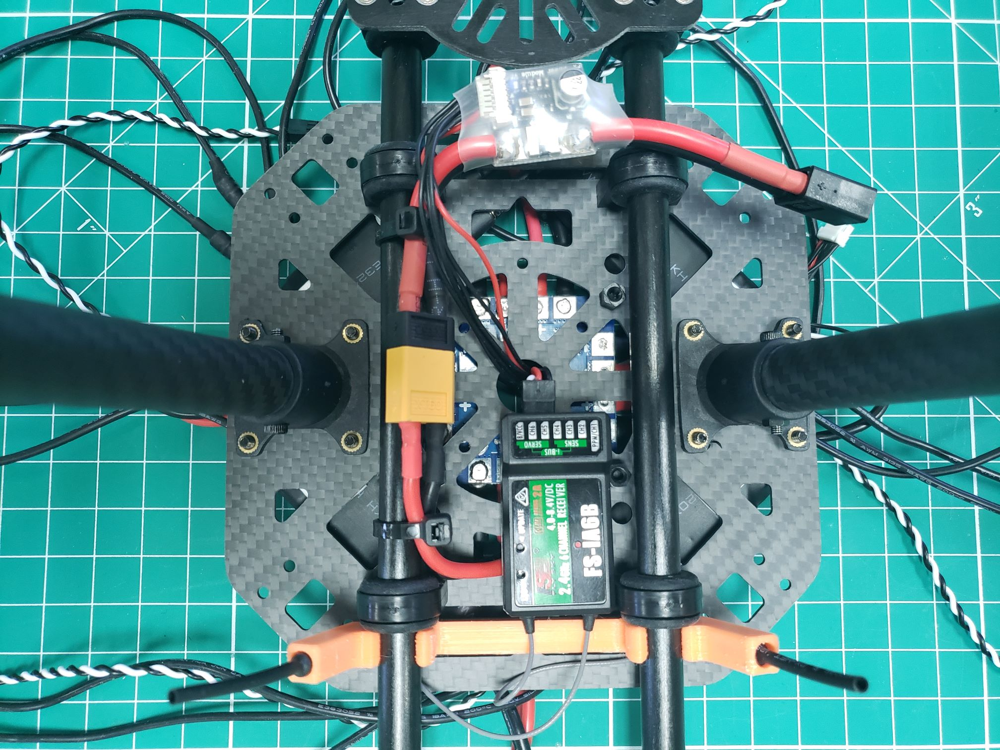
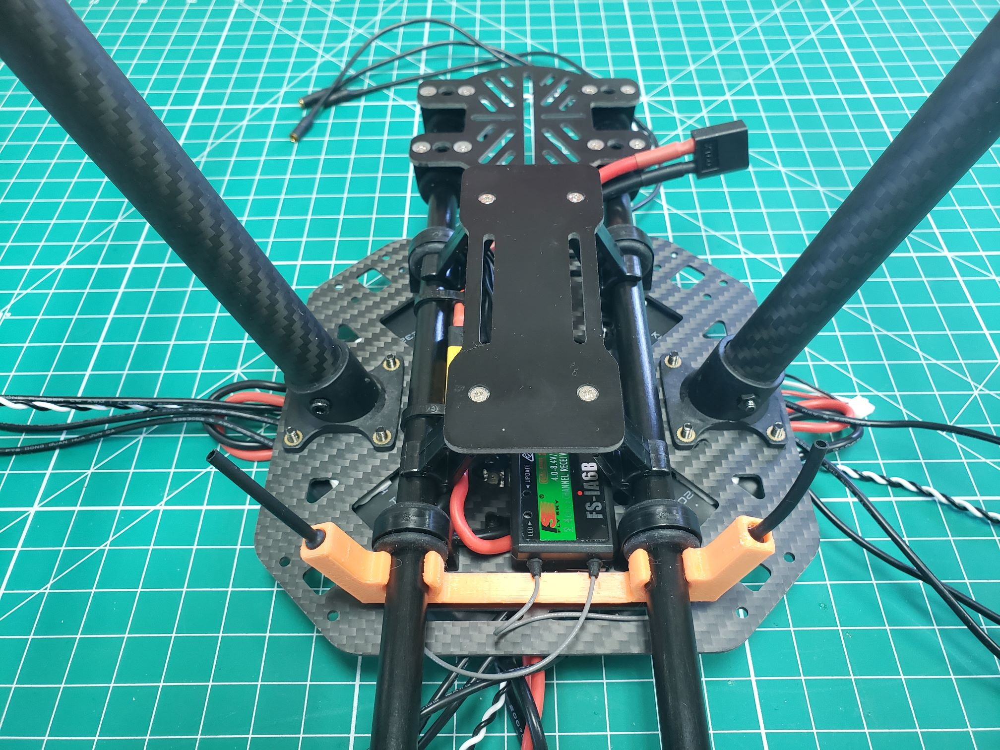

## Mounting the ESCs

The ESCs come with pre-soldered male bullet connectors on the red and black leads.
Also, there are four sets of three extension cables included, which go between the
ESCs and the motors. Go ahead and plug the extension cables into the female
bullet connectors of the ESCs.

We will use double-sided tape to mount the ESCs. We want the ESCs to be raised
enough so they don't make contact with the screw heads protruding from the frame,
so we'll use two pieces of tape on top of each other. The reason we want this
clearance is to make sure the ESCs aren't resting on the screw heads,
which could potentially cause a short. Mount the tape as shown in the photo below.

{}
When stacking the double-sided tape don't forget to peel the
top off the bottom piece so there is a solid bond.
{}

Now we will plug the ESCs into the PDB and firmly place them on the sticky tape.
The red and black male leads must plug into the corresponding female bullet
connectors on the PDB as shown in the photo below. There will be two empty
female connectors on each side of the PDB. It doesn't matter which ones
you use as long as black goes to black, and red to red.

{}
Make sure the XT60 connector from the PDB is pushed through the
cutout near the rear of the bottom plate. This will be used to
connect the FC power module.
{}

## FC Power Module

The yellow XT60 connector coming from the PDB is now coming out at the
bottom of the frame. You can plug the black XT60 connector of the FC power
module into this connector. Use zip ties to secure the power module to the
bottom rail of the frame. When we are finished, the battery will be plugged
into the other end of the power module.

Make sure to put the 6 pin JST-GH connector coming from the power module
through the hole in the middle of the bottom plate. We will plug this into
the FC (which will go on top) later. This cable will provide power to the FMU
as well as voltage and current sensor data.

## RC Receiver Module

We will also mount the RC receiver module on the bottom of the frame.
The receiver for the radio controller has two antennas that work best when
placed at an angle. An orange 3D printed antenna mount is included in the kit.
The antennas should fit right into it and can be attached to the rails.
The receiver can be found in the FlySky FS-i6S box that shipped with the VRC kit.

A small cable with a 6 pin JST-GH connector on one side and a 3 pin
servo connector on the other side should be plugged into the receiver module.
The pins are labeled i-BUS SERVO on the receiver. The signal wire (white)
should be on the outside.

The antenna mount can be easily attached to the rails at the bottom of the drone.
You can slide it forward and backward on the rails if the antennas are blocking a
screw or nut.

You can fix the receiver module itself with a zip tie or double-sided foam tape.
Just like the cable coming from the power module, put the cable with the JST-GH
connector through the hole in the middle of the frame. This cable will plug into
the FC as well.

## Battery Plate

We have installed everything on the bottom of the drone, except for the battery plate.
It consists of a carbon plate with two clamps that are put together with four
small screws. A velcro strap is included to keep the battery in place.

{}
When mounting the battery plate to the arm clamps be sure to use the side of
the plate with recessed screw holes.

It's also smart to check these screws before each flight to make sure they
are secure. You never want to lose a battery during flight!
{}

The battery arm clamps have a bit of bend to them. You should be able to easily,
without much force, clamp them to the rails as seen below.

Nice work! The bottom assembly of the drone is pretty much complete.
In an upcoming section, we'll cover battery safety and mounting with the
included strap. The strap will mount through the slits in the battery plate.
