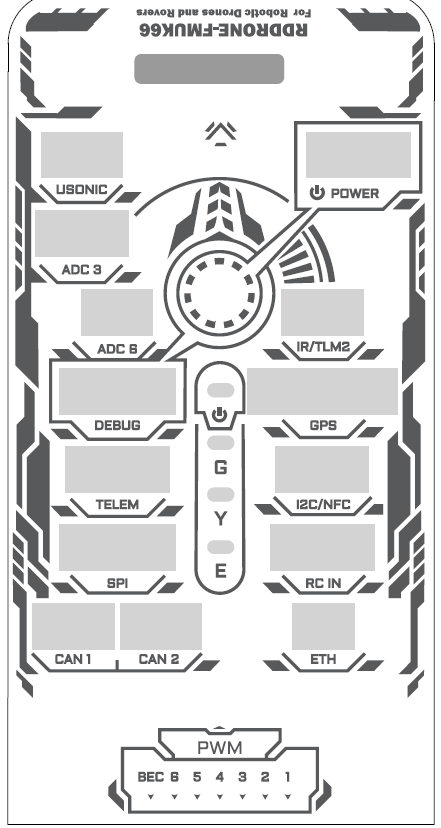
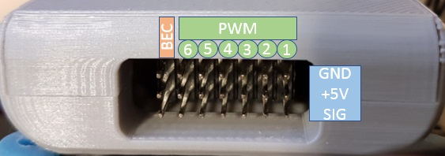

## Connector Pinout

For **Phase 1** we are only concerned with indoor flight in a stabilized flight mode.
This will make our wiring incredibly simple. In **Phase 2** we will add some additional
connections that will allow us to hold position and fly autonomously in a
GPS-denied environment. The image below shows all the ports and servo
connections available on the FC.

Connect the power module cable to the port labeled **POWER**. T
Then connect the receiver cable to **RC IN**. Power will come from the 4S Lipo battery
plugged into the power module and stepped down to a voltage that the FC can handle.
The receiver will receive wireless input from the FlySky transmitter and pass
signals to the FC. This will allow you to manually pilot your VRC drone!

## ESC Wiring

The servo rail pinout is shown in the diagram below.
The ESCs should be connected to the first four sets of pins on the right side.
You will notice the ESC servo leads are black and white,
which means they only contain signal and ground wires.
The ESCs will be powered from the power distribution board
when the battery is plugged in.

The order in which the ESCs should be connected to the servo rail is
important and given by the diagram below. The red arrow
indicates the front of the drone.

Because the ESCs are mounted in a very tight space,
it might be hard to find which wire is coming from which ESC,
and which ESC is connected to which motor.

{}
To more easily identify the correct motor you can pull out the extension
cables and follow them to the ESC. On the other side of the
ESC will be the black/white servo cable that you'll plug into
the corresponding port in the FC's servo rail.
{}

{}
It is extremely important to connect your ESCs in the proper order.
Failure to do so can cause problems on takeoff and will lead to your
VRC drone flipping over.
{}

Be sure to connect all four ESC servo leads with the ground wire (black) on
top and signal wire (white) on the bottom.

{}
Motor rotation is important to make sure the drone can gain altitude and hover.
This will be covered shortly, but know that swapping any two of the three motor
leads will reverse the motor rotation.
{}
