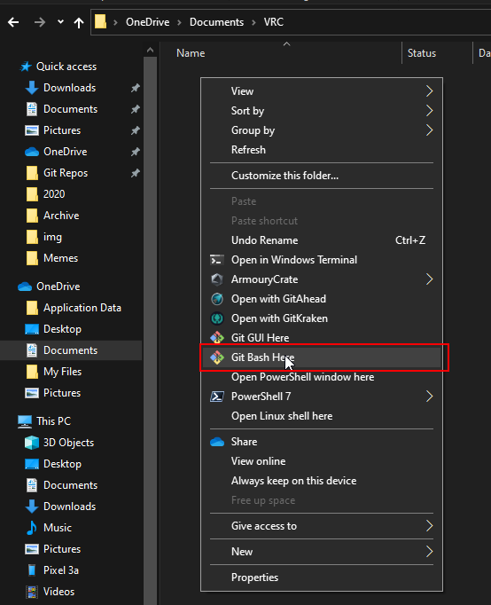
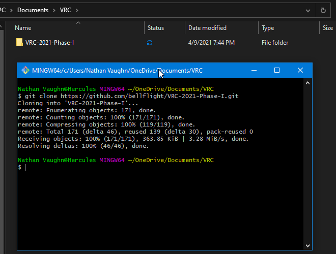

Open a folder on your computer in File Explorer that you want to download the 
VRC repository to. Right-click, and select "Open Git Bash Here".



In the console window that opens, copy and paste the following command:

```bash
git clone https://github.com/bellflight/VRC-2022.git
```

Hit Enter to run it, and git will now download a copy of the 
VRC repository into a new VRC-2022 folder.

