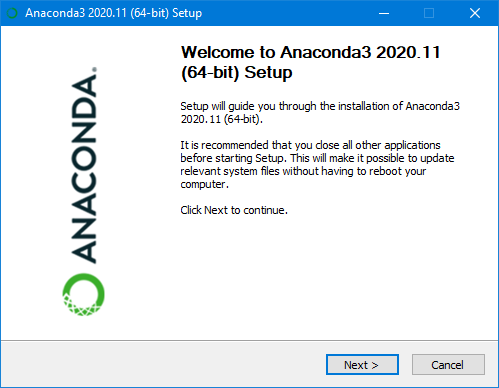
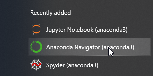
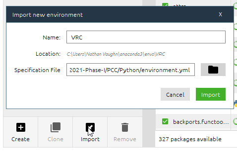

**Anaconda will allow us to create what's called a
[virtual environment](https://www.freecodecamp.org/news/why-you-need-python-environments-and-how-to-manage-them-with-conda-85f155f4353c/),
which will contain all of the necessary Python libraries we need to
develop for the VRC platform.**

You can find the download links [here](https://www.anaconda.com/products/individual).

{}
Install the Graphical Installer for Windows.
{}

{}
Use the default options presented by the installer.
{}

With Anaconda now installed, press the Windows key,
search for "anaconda" and click "Anaconda Navigator".

Click "Environments" on the left-hand side.

Click "Import" and select the file `PCC/Python/environment.yml` file from the
repository you cloned in the previous step. This will create your Python
virtual environment and download all the necessary packages we need to begin developing.

