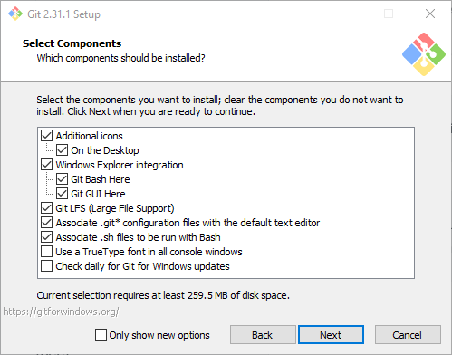
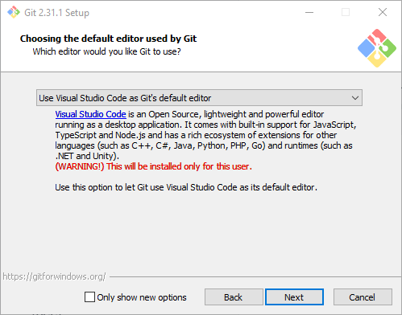

**Git Bash is a terminal app that we'll use to SSH or remote into our drone to
start programs and interact with the Vehicle Management Computer.**

You can find the download links [here](https://git-scm.com/downloads).

{}
Install Git for Windows. Make sure to check "Additional Icons -> On the Desktop".
{}

{}
Make sure to choose "Use Visual Studio Code as Git's default editor as shown below.
We'll install that in a few steps.
{}

Besides the specific callouts above, use the default choices for
the remainder of the install.
