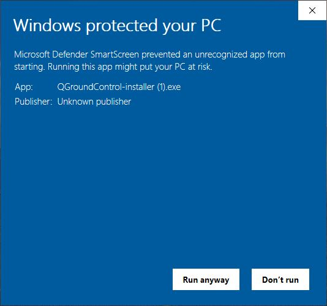
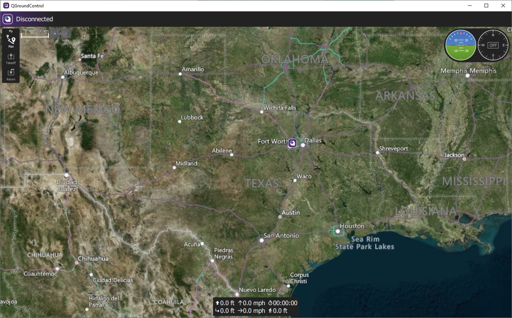

**[QGroundControl](http://qgroundcontrol.com/) is the ground control
software we'll use to interact with our drone's flight controller and
configure settings.**

We recommend using QGroundControl version 4.1.1,
which is the version we used throughout this GitBook.
You can find the download link
[here](https://github.com/mavlink/qgroundcontrol/releases/tag/v4.1.1).

Open the installer and follow the prompts. You may experience the following:

**This is normal for QGC**. It is an open-source application that for some releases
is not signed. Go ahead and click **Run anyway**, because we trust this developer.

{}
If asked, make sure to allow access for firewalls on public AND private networks.
{}

Set the unit system to **Metric**.

QGC is now installed!

