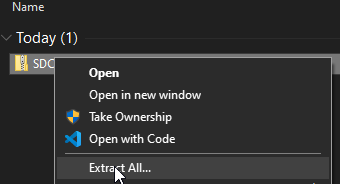
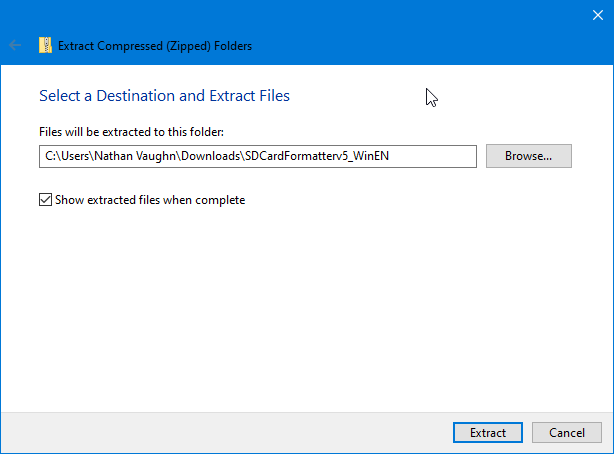

**SD Memory Card Formatter is an application that will allow us to format an
SD Card for first-time use with the Vehicle Management Computer.**

You can find the download link
[here](https://www.sdcard.org/downloads/formatter/sd-memory-card-formatter-for-windows-download/).
Scroll down to the bottom and click "Accept".

Once the `.zip` file has downloaded, right-click it in File Explorer,
and select "Extract All".

Now, click "Extract".

Now, run the installer file inside the extracted folder.
Select all of the default choices.
