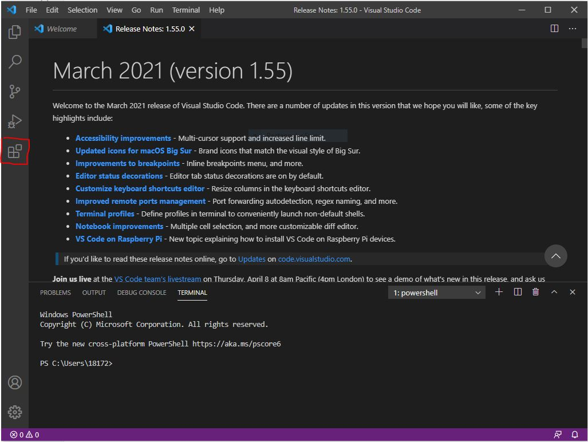
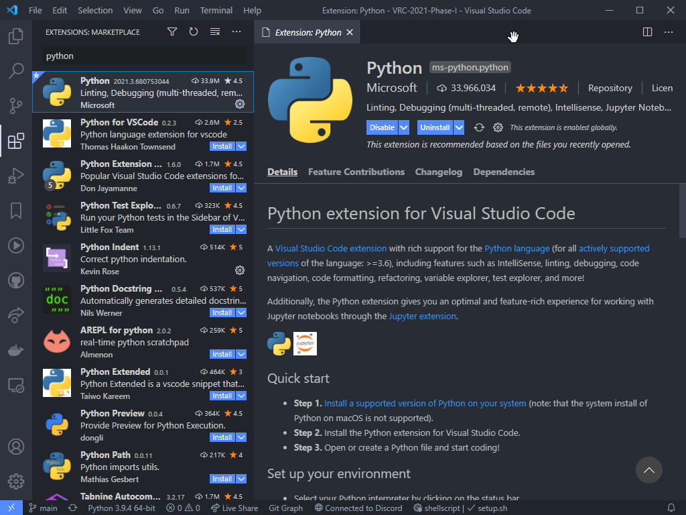
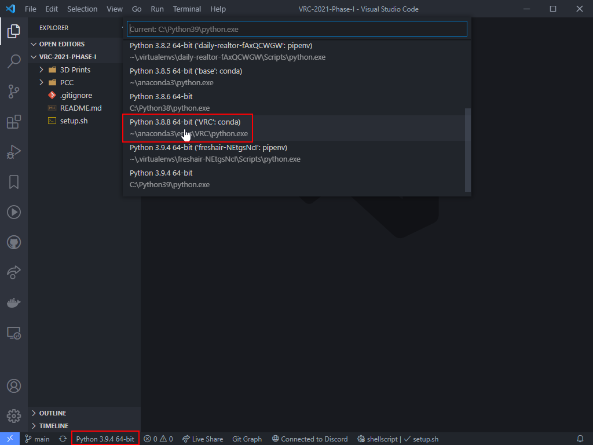

**[Visual Studio Code](https://code.visualstudio.com/docs/editor/whyvscode)
(VS Code) is an editor that allows us to create and edit
Python scripts that will run on our drone's companion computer,
as well as our ground control station computer.**

You can find the download links [here](https://code.visualstudio.com/).

{}
Follow the installer setup, making sure to check the box for "Create a Desktop Icon",
"Add 'Open with Code' action to Windows Explorer file context menu",
"Register Code as an editor for supported file types", and
"Add to PATH (requires shell restart)"
{}

## Configure VS Code

With VS Code installed, we'll want to install some extensions
to help us in our Python development.

- If it's not already running, start VS Code
- Once loaded, click the extensions button on the left toolbar
  (or press Ctrl + Shift + X)

Search for "Python" and click the green install button next to the Python extension.
There's a good chance it's already installed, in which the button
will say uninstall (don't click it if that's the case).

If you see "Select Python Interpreter" in the bottom left of the VS Code window,
click it and choose our virtual environment from the list that we created in the
[Anaconda]() tutorial previously.

That's it! We can now create Python scripts on our development machine.
