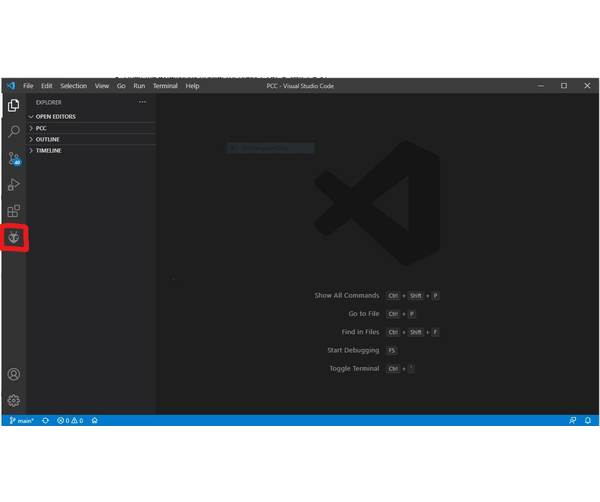

**VS Code can do more than just Python! We can even compile and deploy code to
microcontroller-based devices, like our PCC. In this tutorial, we'll get
VS Code ready to upload our code to the PCC.**

## Install PlatformIO

- Open VS Code
- Open the extensions drawer (or press CTRL + SHIFT + X)
- Search for and install the PlatformIO IDE

### Open the VRC Peripheral Software Project

- Click **PIO** button
- Click **Open**
- Click **Projects**
- Click **Add Existing**
- Navigate to where you cloned the VRC Phase I Repo
- Click **MCU Software**, then **Open**
- Your project will show up
- Click **Open** once more

### Flashing the PCC

- Once the project is open, let PIO build the Intellisense Index and download the
  necessary packages it needs (see the blue bar at bottom of
  VS Code window for progress)
- Once that's done, open the `src/main.cpp` file
- Click the **checkmark** (the program should build)
- Plug your assembled PCC into a USB port on your computer
- Click the **right arrow** (project should flash onto PCC)

{}
You're now ready to test it out!
{}
