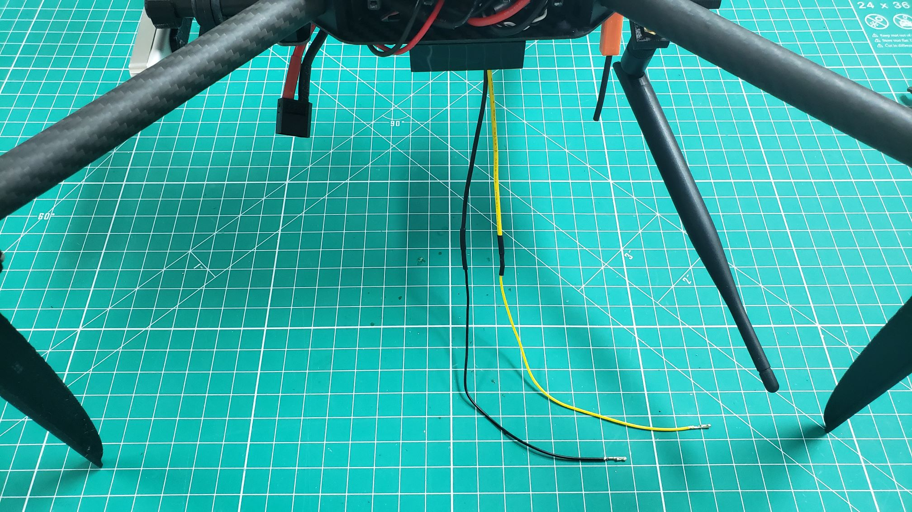
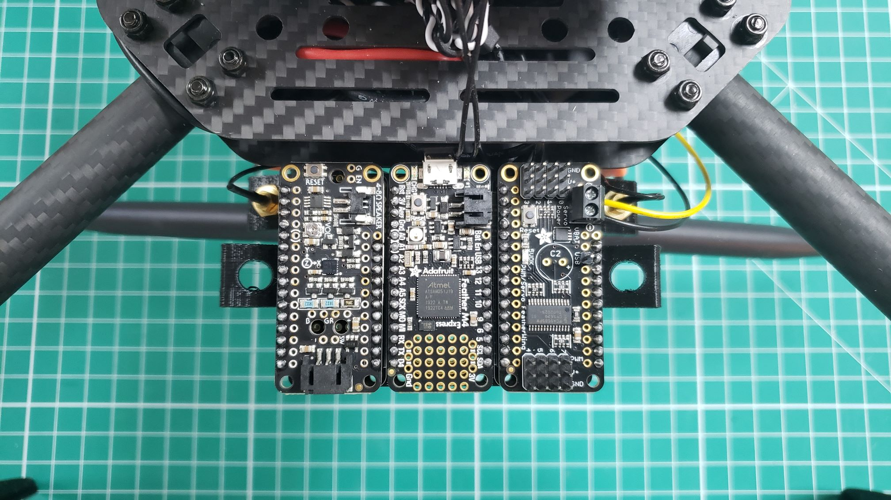
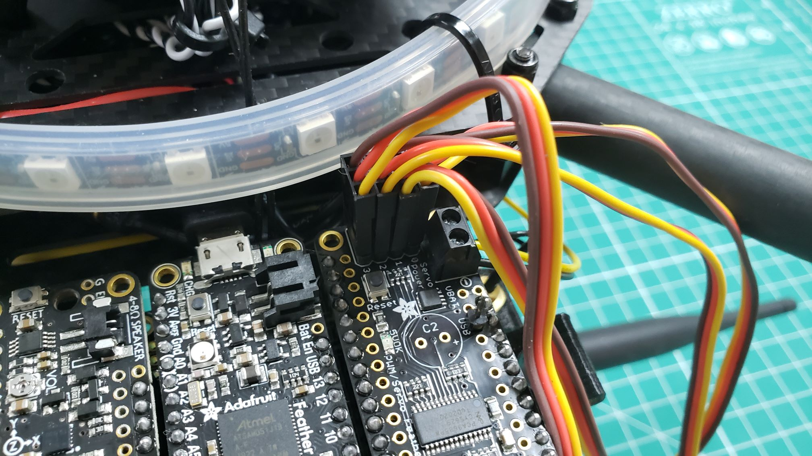

In Phase I you learned how to
[assemble the PCC]()
and
[interface with it over USB]()
connected to a computer. In Phase II you will take this a step further
by mounting the PCC to your VRC drone and interface with it using
the VRC software stack. This will enable you to control the LED ring
color and actuate (open/close) servos programmatically.

We've found that the WiFi antenna mount works quite well for mounting the
PCC to back of the VRC drone. You may end up mounting it in a different
location during your testing, but this serves as a good starting place as
you become more familiar with the capabilities of the PCC.

To keep things simple we recommend attaching the PCC to the antenna mount
using double-sided adhesive. The photo below shows the PCC attached
using the Scotch/3M adhesive.

## Power

Earlier in the GitBook we covered wiring the PCC buck converter.
Now it's time for us to connect the power leads from the buck converter to the PCC.
This will allow the PCC to be powered from the VRC drone's battery.
There's a good chance your power leads are too short to reach the PCC once
mounted on the frame. We will walk through soldering a couple of wires and
extending the leads by a few inches. These spare wires can be found in
**Box 5** of your VRC kit.

Strip, solder, and apply heat shrink to the black and yellow
extension wires as shown in the photo below.

Run the wires from the buck converter to the PCC power input to determine
the necessary length. Cut any excess wire off. Trim 1/4" of wire shield off to
expose the positive and negative wires. Place the exposed wires into the power
connector of the PCC as shown below. You will need a small Phillips head
screwdriver to clamp down on the wires. We used yellow for positive and black
for negative, which matches the leads coming off the buck converter.

{}
Be sure to remove the USB jumper cable that you used for testing in Phase I.
This jumper is no longer necessary now that you've provided adequate power
to the PCC. This will allow for servos to actuate without any problems.
{}

The last step is to connect a micro USB cable to the PCC and the other
end to one of the available ports on the VMC. The photo below shows
the cable connected and routed along the edge of the top plate. This
will keep your build nice and tidy. Feel free to use zip ties to secure the cable.

Slide the PCC mount close to the frame so that the micro USB
connector sits between the top and bottom plates.

## LED Ring

With the PCC mounted let's install the LED ring, which can be located in
**Box 5** of your VRC kit. The LEDs will be crucial on game day and provide
valuable feedback to the judges as well as the GCS operator. An example would
be having the LED ring change to a certain color if the drone is in position
versus stabilized flight mode. The LED ring can also be programmed to change colors
if a certain marker is identified on the court. There are lots of possibilities
and the ring adds some flare to your VRC drone!

Plug the JST connector of the LED ring into the PCC as shown below.

Below is the default mounting location around the top plate of your VRC drone.
You can secure the ring with zip ties attached to the top plate.
Keep in mind that this mounting recommendation is just a suggestion.
Feel free to experiment or even create your own 3D printed mount to raise
the ring up a few inches.

When you become familiar with the VRC software stack you can send RGB
color commands to your ring. The message will be sent from your
Ground Control Station to the VMC over the WiFi network. The VMC will i
nterpret this message, pass it along to the PCC, and change the output color
of the LED ring.

## Servos

The servos for your VRC build will be used during practice and on
competition day. This section will cover how to connect your servos,
but it's up to your team to determine the best mounting option.
Later in this GitBook you will learn how to actuate the servos from the
GCS as well as code!

The servos and extension cables can be found in **Box 5** of your VRC kit.
The extension cables can be used if you need to lengthen the servo connections.

The servos plug into the four ports on the PCC as shown below.
Make sure that the brown wire (ground) faces the edge of the PCC and the
signal wire (orange) faces the bottom of the board.

