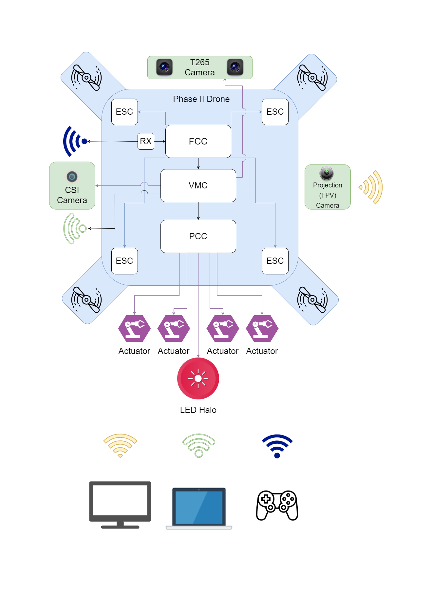

Please make sure you've successfully **built** and **flown** your VRC Phase I drone.
You will be making some extensive modifications to your drone in
preparation for Phase II.

The modifications for Phase II will require some disassembly and the following
additions to your drone:

- **3D printed components**
  - For mounting various cameras and peripherals
- **Vehicle Management Computer (VMC)**
  - Runs VRC code
  - Interfaces with external sensors
  - Provides wireless interface with PX4
- **Camera Serial Interface (CSI)**
  - Downward facing camera
  - For April Tag detection
- **Intel T-265 Tracking Camera**
  - For real-time mapping of the environment
  - For position hold
- **FPV Projection Camera**
  - For a live feed of the game court
- **Peripheral Control Computer (PCC)**
  - For LED and servo actuation

