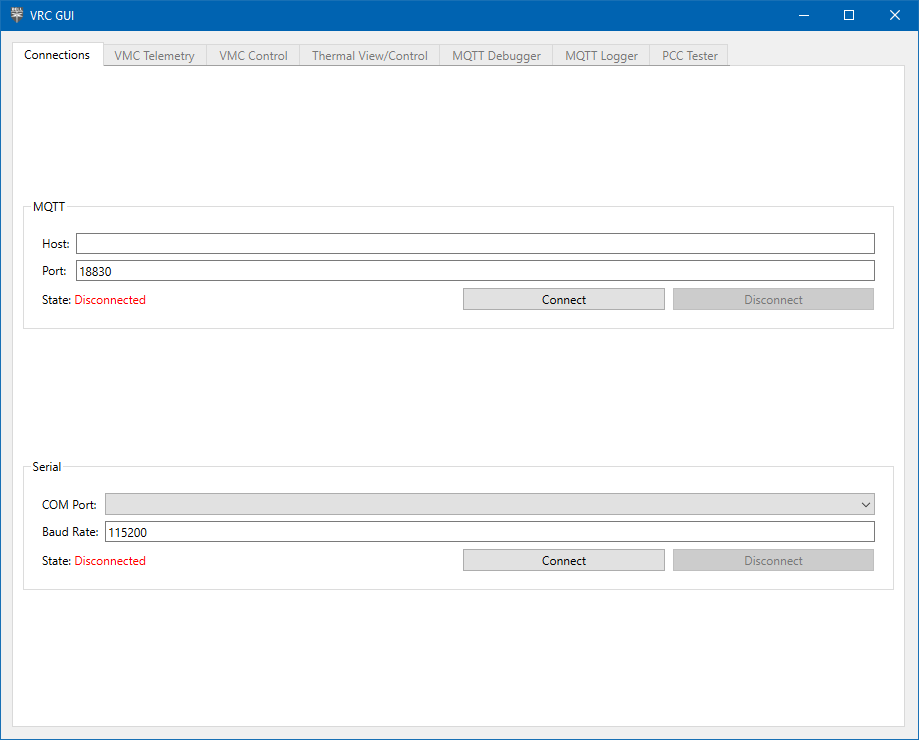

## Physical Setup

On your PCC, we'll need to make use of a USB power jumper to
power the servos from our laptop.

{}
MAKE SURE to **ONLY** use the jumper when testing with your laptop.
**NEVER** use the USB power jumper when the PCC is connected to the Jetson.
This is because the servos may draw enough current in certain scenarios
that would cause the current protection to trip on the power supply and
power off the Jetson regardless of what it's doing.
{}

Plug your servos and LED strip into the designated connections on the PCC:

- The LED strip plugs into the prop-maker featherwing
- The servos plug into channels 0-3, with the yellow signal wire of
  the servo facing the Adafruit logo on the PCB.

### Back at the Computer

Now it's time to download VRC GUI program. Go to the latest
[VRC software release](https://github.com/bellflight/VRC-2022/releases/tag/stable)
and download the `VRCGUI.<hash>.exe` file. Like QGroundControl,
you may need to bypass some warnings about being an untrusted file.

Launch the executable. You should be presented with a screen like this:

In the Serial section, select the COM Port your PCC enumerates as. Click "Connect"
and the "PCC Tester" should now be enabled (we'll talk about the other tabs in
a later section).

TODO add image

{}
Click around and try the different buttons,
your PCC should light up the LED and move some servos!
{}
