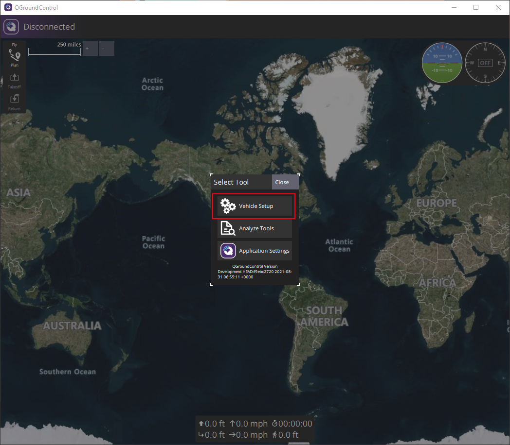
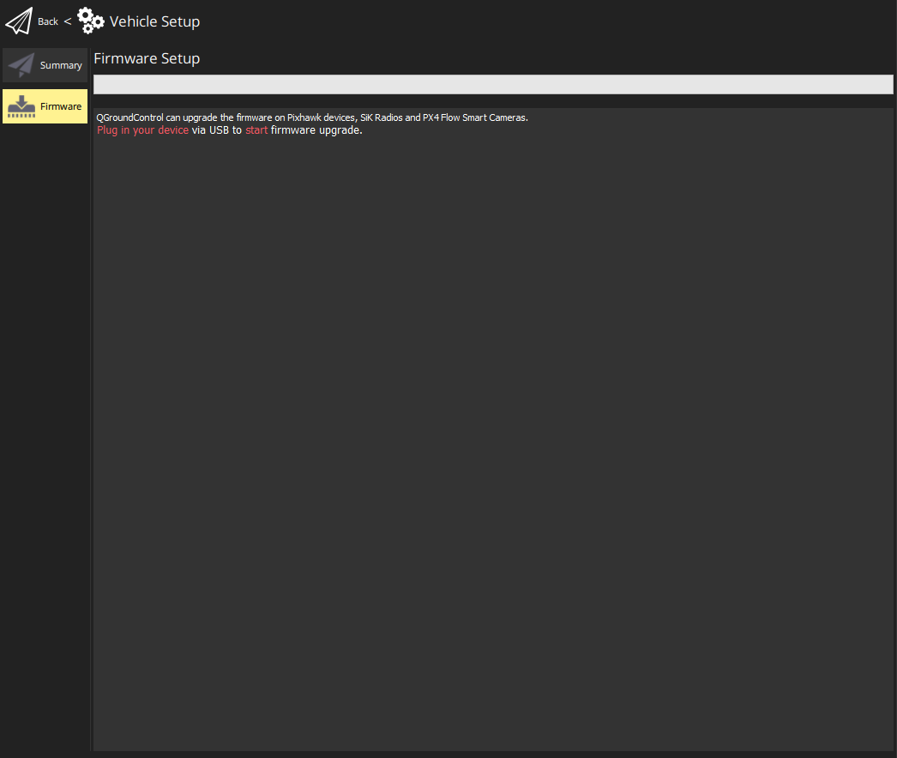

In Phase 2, you'll need to update the firmware of your NXP flight controller,
with a custom version of PX4 in order for your drone to properly work with
the April Tags.

First, download the **`nxp_fmuk66-v3_default.<version>.px4`** file from the latest
GitHub release to your Windows computer:
[https://github.com/bellflight/VRC-2022/releases](https://github.com/bellflight/VRC-2022/releases)

Now, connect the NXP flight controller to your Windows computer with the
included Micro USB cable. Make sure you orient the cable correctly,
it's upside down of what you might expect.

Now, open QGroundControl, click on the "Q" in the top-left,
then "Vehicle Setup" and finally "Firmware".

Once QGroundControl recognizes the flight controller,
select "Advanced Settings", then "Custom firmware file..."

Then click "Ok" and select the firmware file you downloaded.
Now, just let QGroundControl do it's thing.

When it it's finished, you'll see the message "Upgrade complete" and
the window will close itself.

