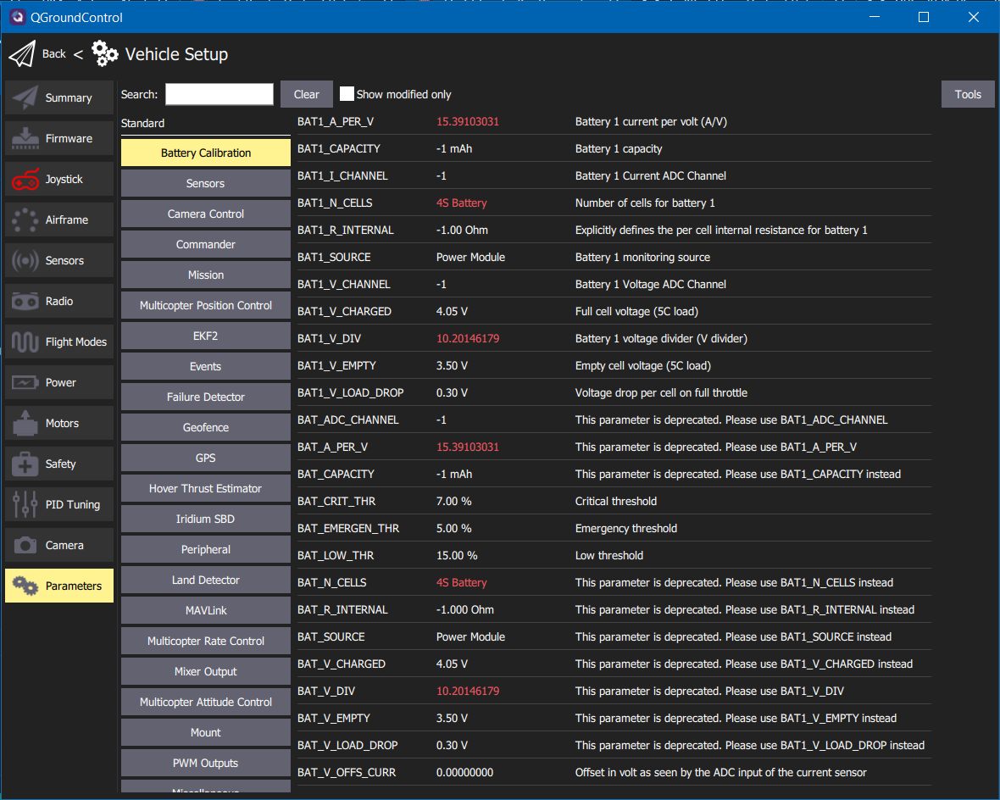

After flashing the custom firmware onto your flight controller,
you need to also load custom parameters into your flight controller as well.
These are basically settings that configure how the flight controller works and
settings around how the drone flies.

First, download this parameter file from GitHub:
[https://github.com/bellflight/VRC-2022/blob/main/PX4/VRCParameters.params](https://github.com/bellflight/VRC-2022/blob/main/PX4/VRCParameters.params)

Like flashing the flight controller firmware, you'll need to plug in the FC
to your computer with the MicroUSB cable.

Now, open QGroundControl, click the "Q" in the top left, then
"Vehicle Setup" then "Parameters" at the bottom of the list.

Click on "Tools" in the top right then select "Load from file..."
and select the VRC parameter file you downloaded.

Then click "Ok" to load the parameters.

Then click "Ok" a bunch of times as QGroundControl informs
you that many parameter changes requires a vehicle reboot.

Then go back to "Tools" and select "Reboot Vehicle" at the
bottom of the list to restart the flight controller for the parameters to take effect.
