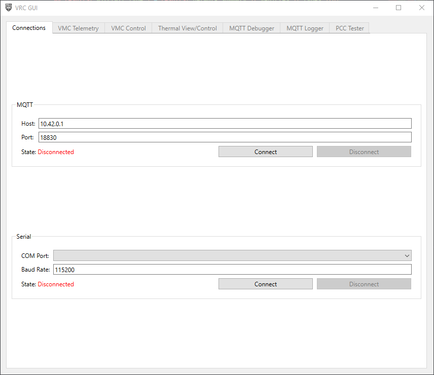
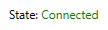

## Setup

You should have already setup the VRC GUI when testing your PCC [here]().

## Usage

Open the application. You'll be brought to the Connections tab.
After starting the VRC software on your Jetson, put in the Jetson's
IP address under the "MQTT" section. Leave the port as is.



Click "Connect", and make sure the application properly connects.



If the application is unable to connect to your drone, the state will show as
"Failure". Make sure the software is running, and you got the IP address correct.

After the application connects, all the VMC-related tabs will become enabled.

## Tabs

### VMC Control


Now, you can click the buttons to change the color of the LEDs,
open and close servos, and do a full peripheral computer reset.

At the bottom of the control window are status icons for the various
software modules, indicating if they're online. If these are all green,
you are good to fly!


#### Autonomous Mode

As for the "Autonomous" buttons of the software,
this is purely optional for the teams that have chosen to write autonomous code.
These buttons send a message to the MQTT topic `vrc/autonomous` with a payload of

```json
// enable button
{
    "enable": true,
}

// disable button
{
    "enable": false,
}
```

For any teams writing their own autonomous code,
they can write a listener for this topic to enable/disable their
autonomous code at certain points, rather than have it run continuously
the entire time.

Example implementation:

```python
from bell.vrc.mqtt.client import MQTTModule
from bell.vrc.mqtt.payloads import VrcAutonomousPayload

class Sandbox(MQTTModule):
    def __init__(self) -> None:
        self.enabled = False
        self.topic_map = {"vrc/autonomous": self.on_autonomous_message}

    ...

    def on_autonomous_message(self, payload: VrcAutonomousPayload) -> None:
        self.enabled = payload["enable"]

    def autonomous_code(self) -> None:
        if self.enabled:
            do_stuff()
```

### MQTT Debugger

The MQTT Explorer window is a debug console that shows all of
the MQTT messages being sent by the software running on the drone.
The relevant topics and data structures needed to write your own
autonomous software is covered in the README of the Phase II repository:
[https://github.com/bellflight/VRC-2022/](https://github.com/bellflight/VRC-2022/)

You can safely close this window.
