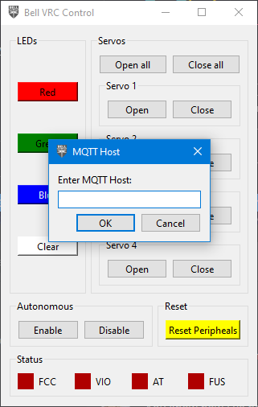
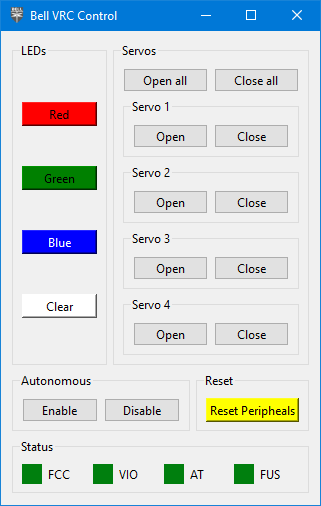
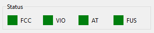
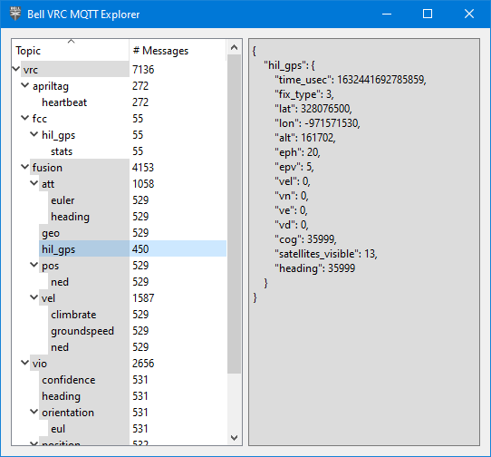

## Setup

TODO

## Usage

Now, you'll be able to open the file `GUI/app.py` and hit the Play button in VS Code.

{}
The VRC software must be already be running on the VMC!
{}

When the application starts, it'll ask for the IP address of your drone.



Enter that, and click "Ok". The application will now connect to your drone.


If the application is unable to connect to your drone,
it'll show an error message and exit.

### Control Window



Now, you can click the buttons to change the color of the LEDs,
open and close servos, and do a full peripheral computer reset.

At the bottom of the control window are status icons for the various
software modules, indicating if they're online. If these are all green,
you are good to fly!



#### Autonomous Mode

As for the "Autonomous" buttons of the software,
this is purely optional for the teams that have chosen to write autonomous code.
These buttons send a message to the MQTT topic `vrc/autonomous` with a payload of

```json
// enable button
{
    "enable": true,
}

// disable button
{
    "enable": false,
}
```

For any teams writing their own autonomous code,
they can write a listener for this topic to enable/disable their
autonomous code at certain points, rather than have it run continuously
the entire time.

Example implementation:

```python
class Sandbox():
    def __init__(self) -> None:
        self.enabled = False

    ...

    def on_autonomous_message(self, payload: dict) -> None:
        self.enabled = payload["enable"]

    def autonomous_code(self) -> None:
        if self.enabled:
            do_stuff()
```

### MQTT Explorer Window



The MQTT Explorer window is a debug console that shows all of
the MQTT messages being sent by the software running on the drone.
The relevant topics and data structures needed to write your own
autonomous software is covered in the README of the Phase II repository:
[https://github.com/bellflight/VRC-2022/](https://github.com/bellflight/VRC-2022/)

You can safely close this window.
