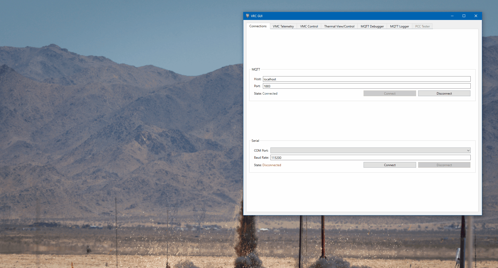
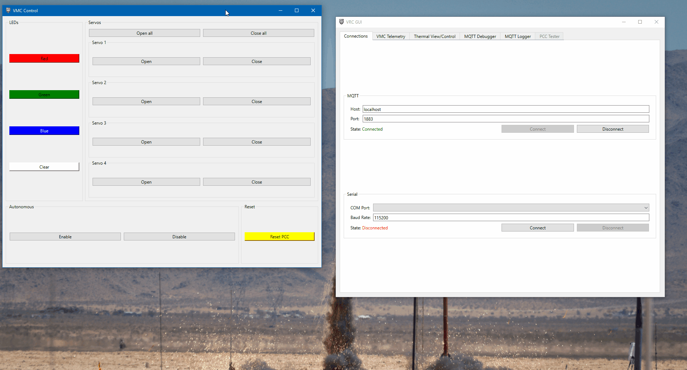
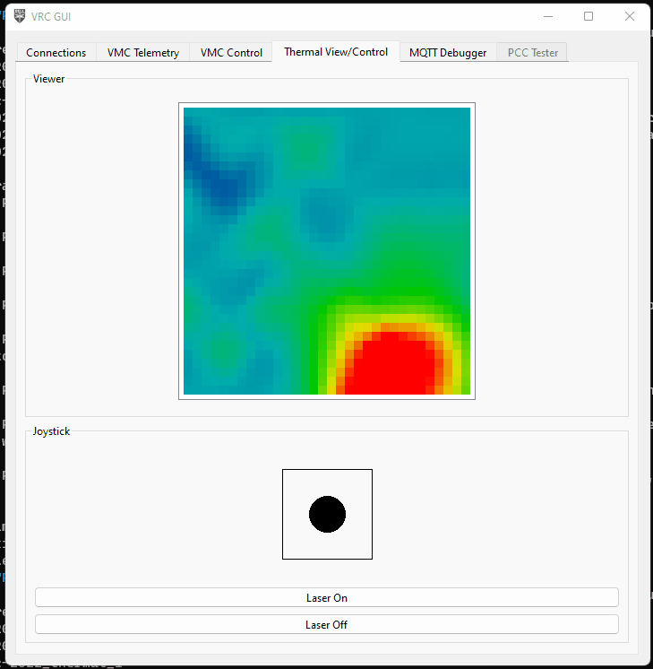

## Setup

You should have already setup the VRC GUI when testing your PCC
[here]().

## Usage

Open the application. You'll be brought to the Connections tab.
After starting the VRC software on your Jetson, put in the Jetson's
IP address under the "MQTT" section. Leave the port as is.


Click "Connect", and make sure the application properly connects.


If the application is unable to connect to your drone, the state will show as
"Failure". Make sure the software is running, and you got the IP address correct.

After the application connects, all the VMC-related tabs will become enabled.

## Tabs

The functionality of the application is broken up into multiple tabs. These
tabs are automatically enabled/disabled based on the connectivity currently
available. These tabs can be re-ordered as desired. Additionally,
the tabs can be popped out into seperate windows to create a multi-pane
view, either by double clicking the tab, or right-clicking and selecting "Pop out".



To reattach a tab, just close the window.



### VMC Telemetry

This tab is a sort of QGroundControl "Lite" that shows the most important
telemetry information from the drone. This is **NOT** a full replacement for
QGroundControl, but quick view of important information while your drone is flying.

At the top is the status of the flight controller, with information about
the current GPS fix, battery level and voltage, armed status, and selected
flight mode.

In the middle is the current location of the drone in local and global coordinates,
along with the current attitude of the drone in roll, pitch, yaw.

Finally, at the bottom is a display of the status of the software modules
required for stabilized flight and April Tag detection. These indicators will
turn green once MQTT messages are recieved from a module, and will
turn red if more than a second has elapsed since the last recieved message.

TODO image

If all 4 indicators are green, you are good to fly!

### VMC Control

TODO image

This tab allows you to control various aspects of the drone, including the
LEDs, and servos connected to the PCC.

Click the individual open/close buttons to open/close individual servos, or click
the open/close all buttons at the top of open/close all of the servos at once.

Click the color buttons to change the color of the LEDs
to one of the presets (red, green, blue). The "clear" button at the bottom
turns off the LEDs.

#### Autonomous Mode

As for the "Autonomous" buttons in the tab,
this is purely optional for the teams that have chosen to write autonomous code.
These buttons send a message to the MQTT topic `vrc/autonomous` with a payload of:

```json
// enable button
{
    "enable": true,
}

// disable button
{
    "enable": false,
}
```

For any teams writing their own autonomous code,
they can write a listener for this topic to enable/disable their
autonomous code at certain points, rather than have it run continuously
the entire time.

Example implementation:

```python
from bell.vrc.mqtt.client import MQTTModule
from bell.vrc.mqtt.payloads import VrcAutonomousPayload

class Sandbox(MQTTModule):
    def __init__(self) -> None:
        self.enabled = False
        self.topic_map = {"vrc/autonomous": self.on_autonomous_message}

    ...

    def on_autonomous_message(self, payload: VrcAutonomousPayload) -> None:
        self.enabled = payload["enable"]

    def autonomous_code(self) -> None:
        while self.enabled:
            do_stuff()
```

### Thermal View/Control



This tab shows a view of the thermal camera, and provides a means of
controlling the gimbal and turning the associated laser on and off.

To use the gimbal, click and drag the black dot and move it around within the box.
The bounds of the box are the gimbal's limit.

### MQTT Debugger

TODO image

This tab is a debugging tool that shows all MQTT messages
that are passing through the VRC software, along with giving
you the ability to manually send messages.

In the top half of the tab is the message viewer. On the left side
is a tree view of all the topics with the levels deonting "/"s in the topic name.
When you click on a topic, on the right side will show the last payload recieved
on that topic, and will update live.

TODO image

To show or hide topics, click the arrow on the left of the trip item to expand or hide
the next level, or right-click the topic and select
"Expand children" or "Collapse children". To expand or collapse everything, select
"Expand all" or "Collapse all".

TODO image

At the bottom of the viewer is a "Running"/"Paused" button that will cause the
viewer to update live, or freeze the current view. This is not associated with the
MQTT connection in the Connections tabs. This only stops the viewer from updating
when trying to look at data.

### MQTT Logger

TODO image

This tab is another debugging tool, that can be used to create
a log of MQTT data that can be analyzed at a later time.
This will create a folder called "logs" next to the `.exe` and create a new
log file with the starting timestamp in the name. The log file is just a `.csv` file
with 3 columns:

1. Timestamp that the message was sent
2. Topic of the message
3. Payload of the message (JSON data as a string)

Short example:

```csv
Timestamp,Topic,Payload
2022-05-15T16:05:21.861220,vrc/fcm/location/local,"{""dX"": -2.5455074310302734, ""dY"": -1.5015729665756226, ""dZ"": 2.0492169857025146, ""timestamp"": ""2022-05-15T18:43:51.529153""}"
2022-05-15T16:05:21.865960,vrc/fcm/attitude/euler,"{""roll"": 0.3597148656845093, ""pitch"": -1.1968730688095093, ""yaw"": -115.29061126708984, ""timestamp"": ""2022-05-15T18:43:51.533150""}"
2022-05-15T16:05:21.867091,vrc/fcm/location/global,"{""lat"": 32.8085261, ""lon"": -97.1563602, ""alt"": -0.1720000058412552, ""hdg"": -6245.665443087664, ""timestamp"": ""2022-05-15T18:43:51.534187""}"
2022-05-15T16:05:21.867533,vrc/fcm/velocity,"{""vX"": 0.009999999776482582, ""vY"": 0.0, ""vZ"": -0.009999999776482582, ""timestamp"": ""2022-05-15T18:43:51.535720""}"
2022-05-15T16:05:21.886569,vrc/fusion/hil_gps,"{""time_usec"": 1652640231557357, ""fix_type"": 3, ""lat"": 328085260, ""lon"": -971563603, ""alt"": 165206, ""eph"": 20, ""epv"": 5, ""vel"": 0, ""vn"": 0, ""ve"": 0, ""vd"": 0, ""cog"": 24600, ""satellites_visible"": 13, ""heading"": 24638}"
2022-05-15T16:05:21.890844,vrc/fcm/location/global,"{""lat"": 32.8085261, ""lon"": -97.1563602, ""alt"": -0.1720000058412552, ""hdg"": -6245.528183606103, ""timestamp"": ""2022-05-15T18:43:51.557302""}"
2022-05-15T16:05:21.891264,vrc/fcm/velocity,"{""vX"": 0.009999999776482582, ""vY"": 0.0, ""vZ"": -0.009999999776482582, ""timestamp"": ""2022-05-15T18:43:51.560023""}"
2022-05-15T16:05:21.901353,vrc/fcm/location/local,"{""dX"": -2.5456197261810303, ""dY"": -1.5016621351242065, ""dZ"": 2.049142837524414, ""timestamp"": ""2022-05-15T18:43:51.571278""}"
2022-05-15T16:05:21.909915,vrc/vio/position/ned,"{""n"": -254.60606976676002, ""e"": -143.7991712686676, ""d"": -370.6543833582757}"
2022-05-15T16:05:21.913765,vrc/vio/orientation/eul,"{""psi"": -2.870100228693062, ""theta"": 0.7509557925331154, ""phi"": -1.982899257543946}"
2022-05-15T16:05:21.914391,vrc/fusion/position/ned,"{""n"": -254.60606976676002, ""e"": -143.7991712686676, ""d"": -370.6543833582757}"
2022-05-15T16:05:21.914799,vrc/vio/heading,"{""degrees"": 246.38824134310744}"
2022-05-15T16:05:21.915277,vrc/vio/velocity/ned,"{""n"": 0.006583199572207324, ""e"": -0.020817144593196127, ""d"": 0.02579902535054221}"
2022-05-15T16:05:21.915846,vrc/vio/confidence,"{""tracker"": 41}"
```

You can do a lot of things with this data. For example,
you can plot how your drone flew through 3D space using
`matplotlib` and `pandas`:

```python
import json

import matplotlib.pyplot as plt
import pandas as pd

df = pd.read_csv("MQTTLog_2022-05-10_17-08-27.csv")

df = df.join(df["Payload"].apply(json.loads).apply(pd.Series))

px4_data = df[df["Topic"] == "vrc/fcm/location/global"]

fig = plt.figure()
ax = plt.axes(projection='3d')

ax.plot3D(px4_data["lat"], px4_data["lon"], px4_data["alt"], label="PX4")

ax.set_xlabel("Latitude")
ax.set_xlabel("Longitude")
ax.set_zlabel("Altitude")

plt.legend()
plt.show()
```


### PCC Tester

TODO image

This is covered when
[testing the PCC]()
