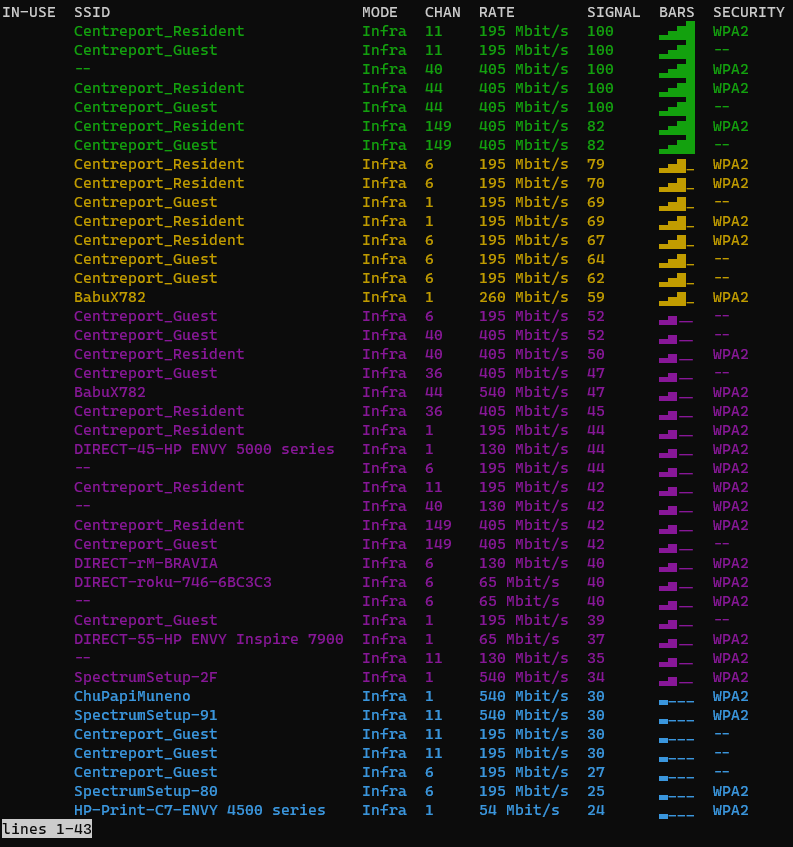
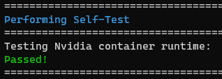

After
[setting up your VMC]()
you're now ready to install the VRC software.

## Internet

In order to install the VRC software, your Jetson needs to have an internet connection.
The easiest way by far is if you have ethernet available. If so, just plug
an ethernet cable into your Jetson and you should be good to go.

If you don't have ethernet, you can use a WiFi connection. First, you can list
the available networks with:

```bash
nmcli device wifi list
```

Example:



Hit <kbd>q</kbd> to exit the list.

If the Jetson is already connected to a WiFi network, you can disconnect it with:

```bash
sudo nmcli device disconnect wlan0
```

To connect to a WiFi network, run:

```bash
# with a password
sudo nmcli device wifi connect <network name> password <password>

# without a password
sudo nmcli device wifi connect <network name>
```

such as:

```bash
sudo nmcli device wifi connect "Keep my WiFi's name out of your mouth" password "smithslap"
```

If your network name or password has a space or other special characters,
you'll need to wrap it in quotes as shown above.

## Install

Run the following commands in sequence:

```bash
git clone --recurse-submodules https://github.com/bellflight/VRC-2022 ~/VRC-2022
cd ~/VRC-2022/VMC/scripts
chmod +x setup.py
./setup.py
```

This clones the software repo, changes directory into the repo you
just cloned, makes the setup script executable,
and then executes the setup script.


This setup script will automatically install and configure
everything needed on your Jetson to get it ready for competition.
This script does download approximately
10GB worth of data the first time, so depending on your
internet connection, it may take a while to run.

At the end of the setup script, it will perform a few self-tests
to make sure everything is configured properly.



Once this is done, please restart your Jetson. Some system settings were changed
that require a reboot to take effect.


## Updating

Bell engineers are constantly working on improving the VMC software.
If a new version is ever available, you just need to go into the
directory the repo is cloned to, pull the latest code, and re-run the setup script:

```bash
cd ~/VRC-2022/VMC/scripts
git pull
./setup.py
```

The `setup.py` script is safe to run at any time,
it won't mess anything up by running it after everything is already configured.

## Troubleshooting

### Release is not valid yet

Example output:

```text
Get:1 file:/var/cuda-repo-l4t-10-2-local  InRelease
Ign:1 file:/var/cuda-repo-l4t-10-2-local  InRelease
Get:2 file:/var/visionworks-repo  InRelease
Ign:2 file:/var/visionworks-repo  InRelease
Get:3 file:/var/visionworks-sfm-repo  InRelease
Ign:3 file:/var/visionworks-sfm-repo  InRelease
Get:4 file:/var/visionworks-tracking-repo  InRelease
Ign:4 file:/var/visionworks-tracking-repo  InRelease
Get:5 file:/var/cuda-repo-l4t-10-2-local  Release [564 B]
Get:6 file:/var/visionworks-repo  Release [2,001 B]
Get:7 file:/var/visionworks-sfm-repo  Release [2,005 B]
Get:5 file:/var/cuda-repo-l4t-10-2-local  Release [564 B]
Get:8 file:/var/visionworks-tracking-repo  Release [2,010 B]
Ign:9 https://repo.download.nvidia.com/jetson/common r32.7 InRelease
Get:6 file:/var/visionworks-repo  Release [2,001 B]
Get:7 file:/var/visionworks-sfm-repo  Release [2,005 B]
Get:8 file:/var/visionworks-tracking-repo  Release [2,010 B]
Ign:10 https://repo.download.nvidia.com/jetson/t210 r32.7 InRelease
Err:11 https://repo.download.nvidia.com/jetson/common r32.7 Release
  Certificate verification failed: The certificate is NOT trusted. The certificate chain uses not yet valid certificate.  Could not handshake: Error in the certificate verification. [IP: 23.221.220.78 443]
Err:12 https://repo.download.nvidia.com/jetson/t210 r32.7 Release
  Certificate verification failed: The certificate is NOT trusted. The certificate chain uses not yet valid certificate.  Could not handshake: Error in the certificate verification. [IP: 23.221.220.78 443]
Hit:13 http://ports.ubuntu.com/ubuntu-ports bionic InRelease
Get:15 http://ports.ubuntu.com/ubuntu-ports bionic-updates InRelease [88.7 kB]
Hit:18 http://ports.ubuntu.com/ubuntu-ports bionic-backports InRelease
Hit:19 http://ports.ubuntu.com/ubuntu-ports bionic-security InRelease
Reading package lists... Done
E: The repository 'https://repo.download.nvidia.com/jetson/common r32.7 Release' no longer has a Release file.
N: Updating from such a repository can't be done securely, and is therefore disabled by default.
N: See apt-secure(8) manpage for repository creation and user configuration details.
E: The repository 'https://repo.download.nvidia.com/jetson/t210 r32.7 Release' no longer has a Release file.
N: Updating from such a repository can't be done securely, and is therefore disabled by default.
N: See apt-secure(8) manpage for repository creation and user configuration details.
E: Release file for file:///var/cuda-repo-l4t-10-2-local/Release is not valid yet (invalid for another 2259d 1h 0min 15s). Updates for this repository will not be applied.
E: Release file for file:///var/visionworks-repo/Release is not valid yet (invalid for another 1888d 8h 9min 54s). Updates for this repository will not be applied.
E: Release file for file:///var/visionworks-sfm-repo/Release is not valid yet (invalid for another 1869d 23h 29min 17s). Updates for this repository will not be applied.
E: Release file for file:///var/visionworks-tracking-repo/Release is not valid yet (invalid for another 1869d 23h 30min 39s). Updates for this repository will not be applied.
E: Release file for http://ports.ubuntu.com/ubuntu-ports/dists/bionic/InRelease is not valid yet (invalid for another 1218d 5h 2min 38s). Updates for this repository will not be applied.
E: Release file for http://ports.ubuntu.com/ubuntu-ports/dists/bionic-updates/InRelease is not valid yet (invalid for another 2728d 6h 14min 58s). Updates for this repository will not be applied.
E: Release file for http://ports.ubuntu.com/ubuntu-ports/dists/bionic-backports/InRelease is not valid yet (invalid for another 2728d 5h 42min 43s). Updates for this repository will not be applied.
E: Release file for http://ports.ubuntu.com/ubuntu-ports/dists/bionic-security/InRelease is not valid yet (invalid for another 2728d 5h 39min 48s). Updates for this repository will not be applied.
```

This usually means your system's time is not correct. Try running the following
commands to force your system to correct its time.

```bash
# After each attempt, run the `date` command to check the time to see if it worked

# Option 1:
sudo hwclock --hctosys

# Option 2:
sudo timedatectl set-ntp off
sudo timedatectl set-ntp on

# Option 3:
sudo service systemd-timesyncd restart

# Option 4:
# This is a final brute-force option that is not recommended.
# Substitute in the date and time you're running the command at
sudo date -s '2022-12-25 12:34:56'
```

### ZED camera not detected

Example output:

```text
WARNING: ZED camera not detected, skipping settings download
```

Obviously, make sure your ZED Mini camera is plugged in to the Jetson. If not,
plug it in and re-run the setup script.

However, if it is, this sometimes happens because of a finnicky USB detection.
Try running the setup script once or twice more until it picks it up and works.

### Connection Issues

Example output:

```text
Get:1 file:/var/cuda-repo-l4t-10-2-local  InRelease
Ign:1 file:/var/cuda-repo-l4t-10-2-local  InRelease
Get:2 file:/var/visionworks-repo  InRelease
Ign:2 file:/var/visionworks-repo  InRelease
Get:3 file:/var/visionworks-sfm-repo  InRelease
Ign:3 file:/var/visionworks-sfm-repo  InRelease
Get:4 file:/var/visionworks-tracking-repo  InRelease
Ign:4 file:/var/visionworks-tracking-repo  InRelease
Get:5 file:/var/cuda-repo-l4t-10-2-local  Release [564 B]
Err:6 http://ports.ubuntu.com/ubuntu-ports bionic InRelease
  Could not connect to ports.ubuntu.com:80 (0.0.0.0). - connect (111: Connection refused)
Err:7 http://ports.ubuntu.com/ubuntu-ports bionic-updates InRelease
  Unable to connect to ports.ubuntu.com:http:
Err:8 http://ports.ubuntu.com/ubuntu-ports bionic-backports InRelease
  Unable to connect to ports.ubuntu.com:http:
Err:9 http://ports.ubuntu.com/ubuntu-ports bionic-security InRelease
  Unable to connect to ports.ubuntu.com:http:
Get:10 file:/var/visionworks-repo  Release [2,001 B]
Get:11 file:/var/visionworks-sfm-repo  Release [2,005 B]
Get:5 file:/var/cuda-repo-l4t-10-2-local  Release [564 B]
Get:12 file:/var/visionworks-tracking-repo  Release [2,010 B]
Get:10 file:/var/visionworks-repo  Release [2,001 B]
Get:11 file:/var/visionworks-sfm-repo  Release [2,005 B]
Get:12 file:/var/visionworks-tracking-repo  Release [2,010 B]
Hit:13 https://repo.download.nvidia.com/jetson/common r32.7 InRelease
Get:14 https://repo.download.nvidia.com/jetson/t210 r32.7 InRelease [2,550 B]
Fetched 2,550 B in 1s (1,843 B/s)
Reading package lists... Done
Building dependency tree
Reading state information... Done
All packages are up to date.
W: Failed to fetch http://ports.ubuntu.com/ubuntu-ports/dists/bionic/InRelease  Could not connect to ports.ubuntu.com:80 (0.0.0.0). - connect (111: Connection refused)
W: Failed to fetch http://ports.ubuntu.com/ubuntu-ports/dists/bionic-updates/InRelease  Unable to connect to ports.ubuntu.com:http:
W: Failed to fetch http://ports.ubuntu.com/ubuntu-ports/dists/bionic-backports/InRelease  Unable to connect to ports.ubuntu.com:http:
W: Failed to fetch http://ports.ubuntu.com/ubuntu-ports/dists/bionic-security/InRelease  Unable to connect to ports.ubuntu.com:http:
W: Some index files failed to download. They have been ignored, or old ones used instead.
```

If the setup script fails to download something, it likely lost
connection to the internet, or your network is blocking a site it tried
to download content from. Try running the script again.

If that still does not work, look at the VMC software README at
[https://github.com/bellflight/VRC-2022/tree/main/VMC/README.md](https://github.com/bellflight/VRC-2022/tree/main/VMC/README.md)
and the provided list of domain names that the setup script connects to.
Either see if your network administrator can allow these domain names,
or use a personal hotspot or internet connection.
