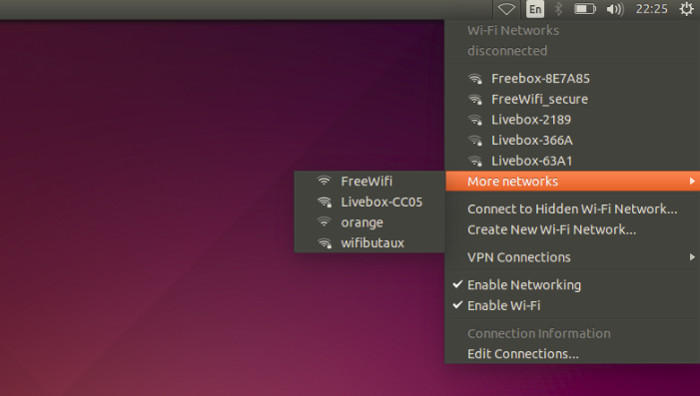
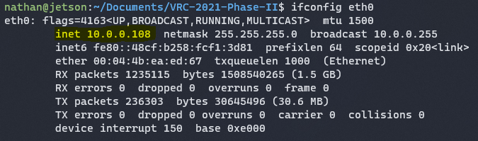
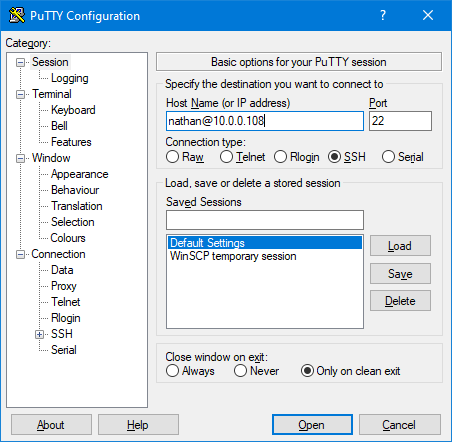
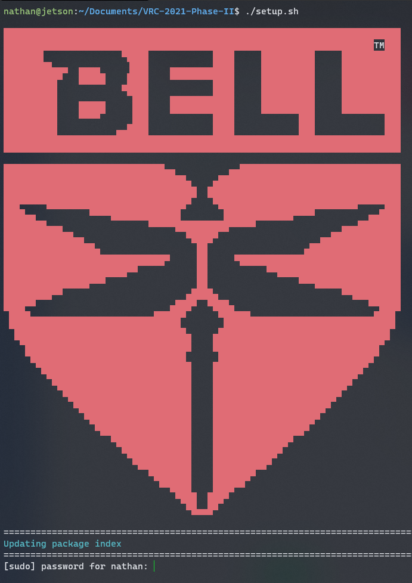
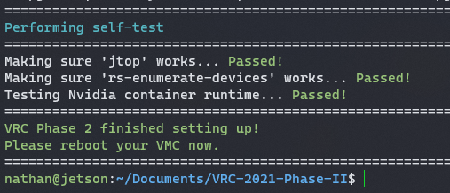
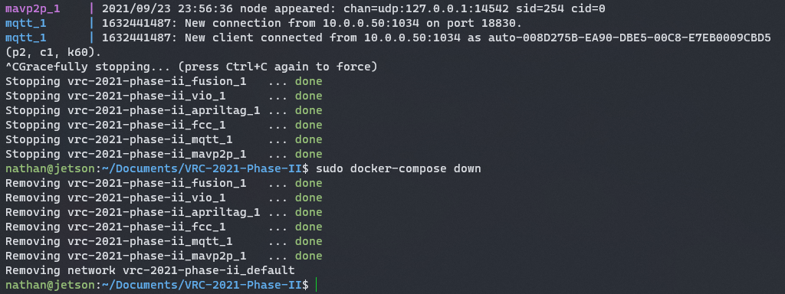
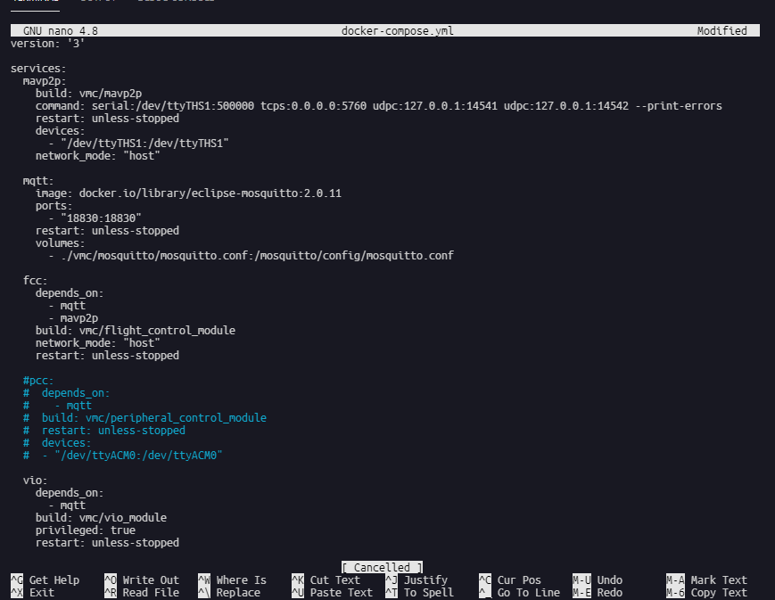
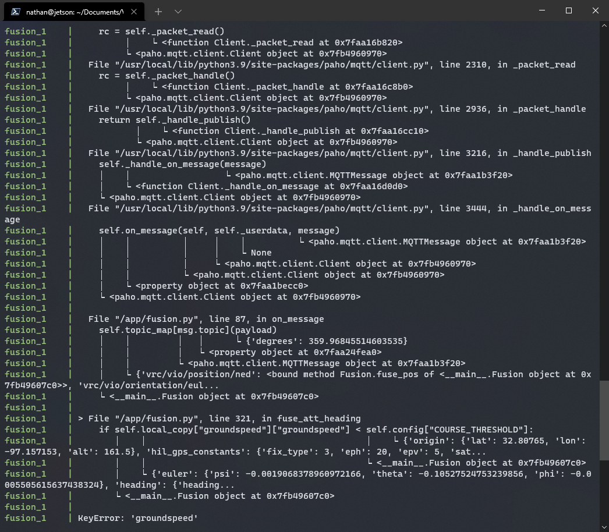

## Setup

After
[setting up your VMC]()
you're now ready to install the VRC software.
There are two possible ways to setup your Jetson.

### Option 1 (KVM)

Possibly the simplest way to setup your Jetson with is a mouse, keyboard, monitor.
If you have ethernet available, plug that into the Jetson, as you will
need internet access. Otherwise, once you login to the Jetson,
connect to a WiFi network in the top right.



Once signed in, open up a terminal.
This can be done by clicking the application launcher
in the bottom left (the 9 squares) or with the shortcut
<kbd>Ctrl</kbd>+<kbd>Alt</kbd>+<kbd>t</kbd>.

### Option 2 (Serial)

The second (and more complicated) method of setting up your Jetson is using PuTTy
[like you did before]().
If you want to power the Jetson via USB (if it's not connected to
a wall adapter or a battery) remove the jumper behind the barrel jack,


then plug in the MicroUSB cable to the Jetson,


and then into your laptop. Open up PuTTy and log in to the Jetson.

If you have ethernet available, plug that in. Otherwise,
you can connect to WiFi via the command line (remove the
angle brackets when putting in your WiFi network details):

```bash
nmcli radio wifi on
sudo nmcli dev wifi connect '<wifi network name>' password '<wifi network password>'
```

Make sure to replace the jumper when you're done!

{}
This method can also be helpful if you've already configured the
Jetson to connect to a WiFi network, but don't know what the IP address is.
{}

### SSH

In the future, you'll want to use SSH to login to your Jetson,
as it is far easier. However, to do so, you'll need to know
the IP address of your Jetson. The simplest way to figure this out if
you don't know is to login via serial, and then run the command

```bash
ifconfig eth0
```

if you've connected the Jetson to ethernet or

```bash
ifconfig wlan0
```

if you've connected the Jetson to WiFi.



Once you've recorded this, you can then sign in with PuTTy.
Make sure to enter the hostname as `user@ip`.



You'll need to accept that you trust a certificate the first time.

## Commands

Now, run the following commands in sequence:

```bash
git clone https://github.com/bellflight/VRC-2022 ~/VRC-2022
cd ~/VRC-2022/VMC/scripts
chmod +x setup.py
./setup.py
```

{}
If you get a message saying "Release file is not yet valid",
this usually means your system's time is not correct. Try running

```bash
sudo hwclock --hctosys
# if the above still does not work, try these two
sudo timedatectl set-ntp off
sudo timedatectl set-ntp on
```

to force your system to correct it's time.
{}

This updates the packages available to install,
installs `git` if it is not already installed,
clones the software repo, changes directory into the repo you
just cloned, makes the setup script executable,
and then executes the setup script.



This setup script will automatically install and configure
everything needed on your Jetson to get it ready for competition.
Make sure to check on the script, as you will likely need to enter
your account password a few times. This script does download approximately
10GB worth of data the first time, so depending on your
internet connection, it may take a while to run.

At the end of the setup script, it will perform a few self-tests
to make sure everything is configured properly.



Once this done, please restart your Jetson. Certain drivers were installed
that require a reboot to take effect.

If the setup script fails to execute for any reason, it likely lost
connection to the internet, or your network is blocking a site it tried
to download content from. Try running the script again.
If that still does not work, look at the README on
[https://github.com/bellflight/VRC-2022/tree/main/VMC/FlightSoftware](https://github.com/bellflight/VRC-2022/tree/main/VMC/FlightSoftware)
and make sure you can connect to all of the websites listed there.

## Updating

Bell engineers are constantly working on improving the VMC software.
If a new version is ever available, you just need to go into the
directory the repo is cloned to, pull the latest code, and re-run the setup script:

```bash
cd ~/VRC-2022/VMC/scripts
git pull
./setup.py
```

The `setup.py` script is safe to run at any time,
it won't mess anything up by running it after everything is already configured.

## Running

To run the VMCsoftware, just go into the directory
the code was cloned to, and run the command `sudo docker-compose up`:

```bash
cd ~/VRC-2022/VMC/
./start.py run
```


To shutdown the software, press <kbd>Ctrl</kbd>+<kbd>C</kbd> in the console
window you started the software in. Additionally, run

```bash
sudo docker-compose down
```

for good measure.



{}
While `docker-compose` is stopping the software,
**DO NOT** hit <kbd>Ctrl</kbd>+<kbd>C</kbd> again to stop it forcefully.
Many components of the software has code in place to close connections
and things as they are stopping and interrupting this process can
cause corrupted states.
{}

If your team chooses not to use certain aspects of the VMC software,
you will need to disable them. For example, while using the PCC
with servos and LEDs is highly encouraged, it's not strictly required,
and if you try to start the software without a PCC connected, it will not launch.

On the drone, open up the file `VMC/FlightSoftware/docker-compose.yml` and add `#`
to the beginning of lines you do not want. The easiest way is with the program `nano`:

```bash
nano VMC/FlightSoftware/docker-compose.yml
```

For example, commenting out the PCC module:



To save the changes, press <kbd>Ctrl</kbd>+<kbd>X</kbd> to exit,
<kbd>Y</kbd> to save the changes, and <kbd>Enter</kbd> to close.

## Troubleshooting

Sometimes when starting the VRC software, things don't all start correctly.

### VIO Module Can't Connect to T265

Try the following in order:

- Try starting the software again. This sometimes works.
- Run the command `rs-enumerate-devices`. This seems to help librealsense pick up the camera.
- Run the script `reset_usb.sh` (you may need to do `chmod +x reset_usb.sh` first).
  This resets all the USB devices.
- Unplug the T265 camera and plug it back in.
- Restart the Jetson.

### Constant Errors in the Console



If you get errors such as this constantly spammed, stop the software and
start it again. Seeing this message once or twice is normal as
all the software components start, but repeatedly should not happen.

### Cannot Start Service PCC


This error means that the VRC software was unable to connect to the PCC.
If you are not using the PCC, follow the steps above to disable that module.

Otherwise, to test that the PCC is correctly connected to the VMC, run the command:

```bash
ls /dev/ttyACM0
```

You'll get the message `ls: cannot access '/dev/ttyACM0': No such file or directory`
if the PCC is not connected. If the PCC is connected,
`/dev/ttyACM0` will get echoed back.
Try unplugging the PCC and plugging it back into the VMC.
