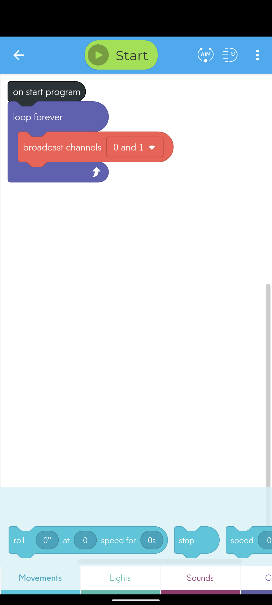

In order to operate the RVR in both manual and auto modes,
we will have to write two programs - one that runs on our phones and one that
runs on the micro:bit itself. Using our phones, we will be able to manually
drive the RVR for certain parts of the competition. For other parts we will
need the RVR to drive itself. For this, we'll program the micro:bit to control the RVR.

If you've completed the RVR assembly, you probably noticed that we installed a remote
trigger at the rear of the RVR. We will use that trigger to switch between manual
and auto modes. By turning on the IR transmitter on the back of the RVR
(using a program on our phone), the remote trigger will sense the IR light and
signal the micro:bit to run its obstacle avoidance algorithm. When we turn off
the IR transmitter (again, using the program on your phone), the micro:bit will
stop executing the obstacle avoidance algorithm.

## Sphero EDU App

In order to manually drive the RVR (and the Sphero minis),
you will need to download and install the Sphero EDU app. It's available at
the following links for iPhone/iPad and Android, respectively.

Apple App Store: [https://apps.apple.com/us/app/sphero-edu/id1017847674](https://apps.apple.com/us/app/sphero-edu/id1017847674)

Google Play: [https://play.google.com/store/apps/details?id=com.sphero.sprk](https://play.google.com/store/apps/details?id=com.sphero.sprk)

The app is fairly straightforward. Once you've downloaded it,
you'll need to create an account. After signing in, you can manually drive
the robots, or you can write programs to automate their actions.
That's what we'll do. Our program is very simple, though.
All we need to do is turn on or off the IR transmitter on the back of the RVR.
The Sphero app uses block coding to write these programs. Below is a screen
shot of the program you should create.

As you can see, it's a very simple program. When you press "start", the
RVR begins emitting IR light out of the IR transmitter mounted on the rear of the RVR.
The littleBit _i7 remote trigger_ detects that light and signals the _micro:bit_ to
start its obstacle avoidance algorithm. The RVR will continue to run this algorithm
until you press "Stop".

## micro:bit Program

This is where the real magic happens. This program will enable the RVR to
drive itself, while (hopefully) avoid crashing into obstacles (walls). In
the most simple terms, whenever the RVR is emitting IR light (controlled by
the program running on our phone) the micro:bit will execute the obstacle
avoidance. The program that we'll write will tell the RVR to drive forward
while monitoring the proximity sensors. If both sensors are detecting an
obstacle, the RVR will turn left. If only one sensor is detecting an obstacle,
the RVR will turn the direction opposite of that sensor (i.e. if the left-hand
sensor detects an obstacle, the RVR will turn right and vice versa) . When the
IR light is turned off (the program running in the Sphero EDU app on your phone
is "stopped"), the micro:bit will stop running the obstacle avoidance algorithm.

Here's the block code of the program:

This program is available
[here](https://github.com/bellflight/VRC-2022/tree/main/RVR/microbit-VRC-Wall-Following-Test-REV-A.hex).
Simply download the .hex file, then plug the micro:bit into your computer and
copy/paste the .hex file onto the micro:bit. It will automatically install.

The current version of the micro:bit code, as of 9/13/21, is REV A.

## Improve the RVR Performance (optional)

The basic obstacle avoidance program is provided for you above, but if you want
to boost the performance of the RVR, you can recreate the program and tweak the
values yourself!

In order to create the program shown above, you will need to navigate to the
Microsoft MakeCode website:
[https://makecode.microbit.org/](https://makecode.microbit.org/).
and click "New Project". Now that you have a new project open, you
need to add an extension specific to the
Sphero RVR. To do so, click "Advanced" in the tray, then click "Extensions".
The extension isn't listed by default, but it's easy to find. Simply copy and paste
this URL into the search bar and hit search:
[https://github.com/sphero-inc/sphero-sdk-microbit-makecode.git](https://github.com/sphero-inc/sphero-sdk-microbit-makecode.git).
Then click on the "SpheroRVR" search result. The extension will be automatically
downloaded and installed for you.

Now you can click and drag the appropriate blocks to build the wall
following algorithm. Once you have an algorithm you'd like to test, simply save
the .hex file, plug in the micro:bit to the computer, and click and drag the .hex
file onto the micro:bit. It will automatically install.

Some tips for building your own program:

- The "heading" and "count" variable were created under the Variables tab
- Make sure the analog pins you select correspond to how the sensors are plugged
  in to the micro:bit. If you followed the build tutorial correctly,
  the analog pins are correctly called out in the block code shown above.
- Try changing the proximity sensor sensitivity and the speed to see if you
  can make your RVR the fastest and most reliable!

If you have questions you can always reach out to us through the
[Microsoft Teams VRC Portal](https://teams.microsoft.com/dl/launcher/launcher.html?url=%2F_%23%2Fl%2Fteam%2F19%3A21c615dc691c4f289fb9fda44c862df3%40thread.tacv2%2Fconversations%3FgroupId%3D6baa0f71-7580-4c72-905f-2b6ee58685c3%26tenantId%3D771923a0-2465-44c5-8531-b9366e228aad&type=team&deeplinkId=daf2e519-e92e-4cbe-8e71-dc0b4bd90266&directDl=true&msLaunch=true&enableMobilePage=true&suppressPrompt=true).
