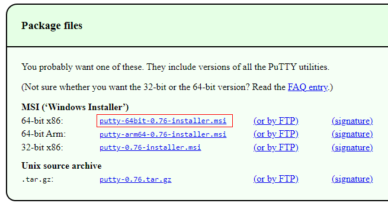
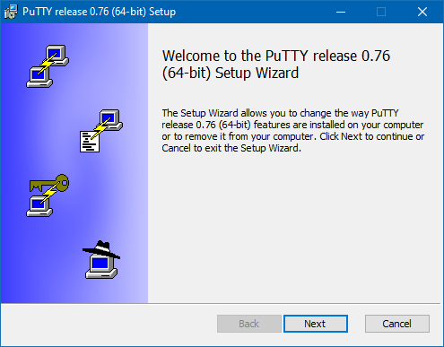
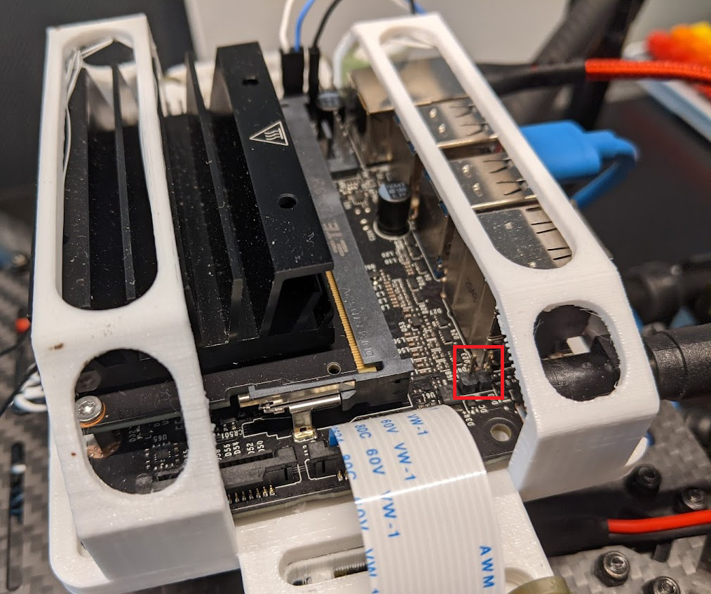
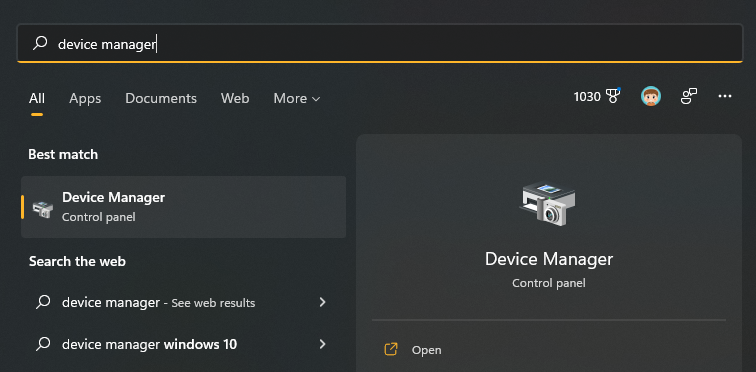
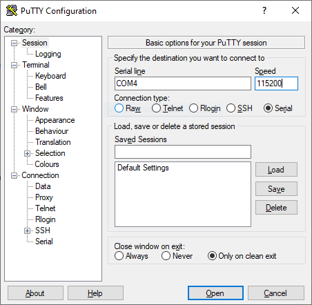
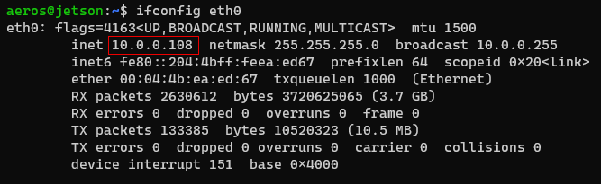
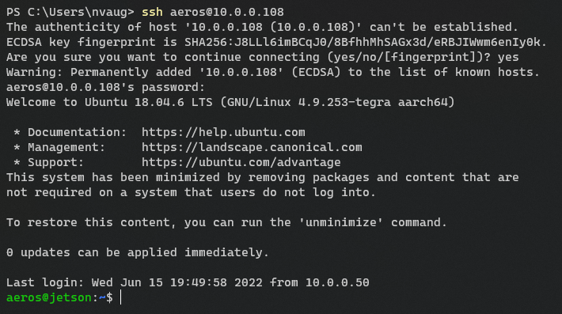
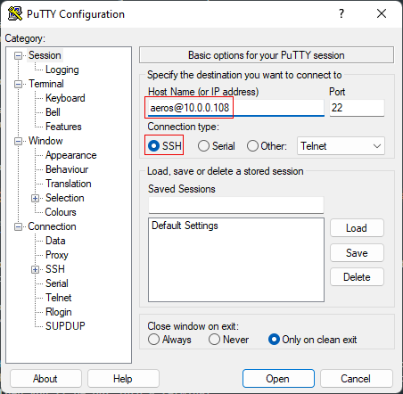
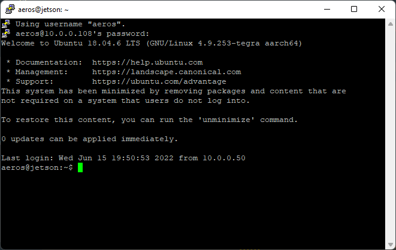
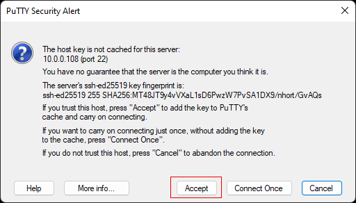

## Monitor and Keyboard

Possibly the simplest way to connect to your Jetson is with
a monitor and keyboard. You'll just need a monitor that has HDMI or DisplayPort
that you can plug in to the Jetson.

If you've already set up your Jetson,
you can open a terminal by clicking the application launcher
in the bottom left (the 9 squares) or with the keyboard shortcut
<kbd>Ctrl</kbd>+<kbd>Alt</kbd>+<kbd>t</kbd>.

## Serial

Another method of logging in to your Jetson is over a serial connection.
To do this, you'll need a serial client such as PuTTy.
Go to [this page](https://www.chiark.greenend.org.uk/~sgtatham/putty/latest.html)
and download and install the `putty-64bit-<version>-installer.msi` file.





Now, if you want to power the Jetson via USB (if the Jetson is not connected to
a wall adapter or a battery) remove the jumper behind the barrel jack.



{}
Keep this somewhere safe, like sticking it to a piece of tape, it's very easy to lose!
{}

Plug in a MicroUSB cable to the Jetson,


and then into your computer. Open up Device Manager,



and find out what COM port your Jetson is on.


Open up PuTTy, choose the COM port you found above for the Serial line,
and put in `115200` as speed.



Click "Open". You should now see the Jetson's terminal.

{}
This method can also be helpful if you've already configured the
Jetson to connect to a network, but don't know what the IP address is.
{}

## SSH

In the future, you'll want to use SSH to login to your Jetson,
as it is far more convenient. SSH is way to login to a Linux system
over a network. However, to do so, you'll need to know
the IP address of your Jetson. The simplest way to figure this out if
you don't know is to login via serial, and then run the command

```bash
ifconfig eth0
```

if you've connected the Jetson to ethernet or

```bash
ifconfig wlan0
```

if you've connected the Jetson to WiFi.



### `ssh` Command

The quickest way to login to yor Jetson over SSH, is to use the builtin `ssh` command
in Windows. Open up a command prompt or PowerShell, and run

```powershell
ssh <user>@<ip>
```

The first time you log in to your Jetson, you'll be prompted to accept
the host's key. Enter `yes`. You'll thenbe prompted for your password,
and then you'll be put into a terminal.



### PuTTy

If you're not comfortable with the command line, you can also use PuTTy to connect
over SSH. Select the "SSH" button in PuTTy, put in the hostname field `<user>@<ip>`
and then click the "Open" button.





You'll need to accept that you trust a key the first time.


