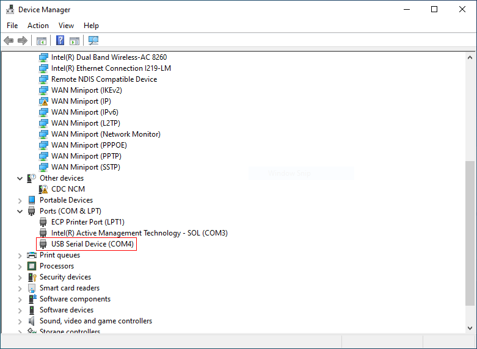
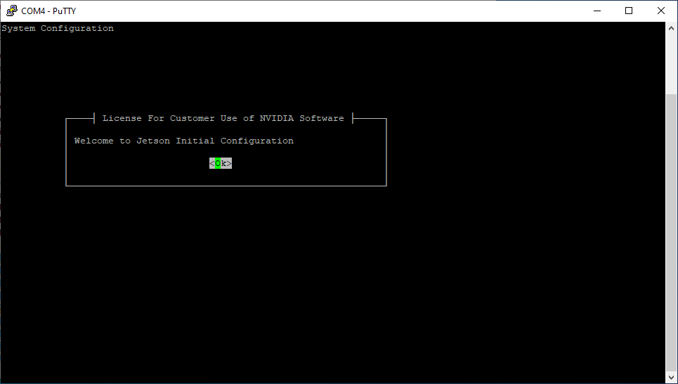

## Initial Setup

Follow this guide in order to get through the Jetson's initial setup.

### Connecting to your Jetson

- Make sure to remove the jumper that says "ADD JUMPER TO DISABLE USB POWER"
  that's just behind the barrel jack
- Insert your SD card under the heatsink
- Plug your jetson into the PC
- Start PuTTy
- Go to device manager, and find out what port your Jetson is on

{}
Look under Ports ( COM & LPT ). My Jetson enumerated as COM4
{}

- Back in PuTTY, choose serial.
- Choose the COM port you found above for the Serial line, and 115200 as speed.

- Click "Open"
- You should now see the Jetson's Terminal

{}
All the navigation here on out will be done via your keyboard when using PuTTY
{}

- Hit enter
- Scroll through agreement and hit enter

### Setting your locale

- Choose English for your language
- Choose US for your country
- Select your timezone
- Allow clock to be set to UTC

### Creating your account

- Enter a name, such as your school's name
- Choose a username, I chose "vrc"
- Choose a password
- When asked about resizing the partition, hit enter

### Connecting to the Internet

If your school has a guest WiFi network, choose that. Otherwise,
if your school has a hard-line ethernet jack you can use, choose ethernet.

Either way, your Jetson needs a connection to the internet.

### Setting the Power Mode

Choose the "maxn" power mode

---

That's it! You've completed basic setup of your Jetson!
