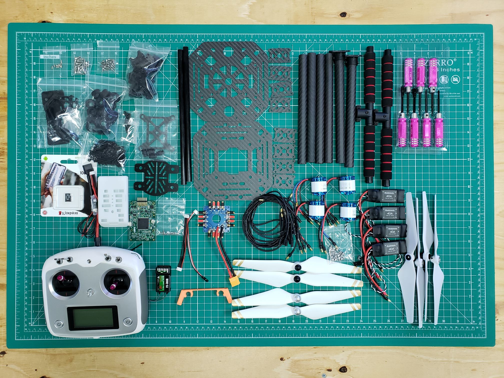
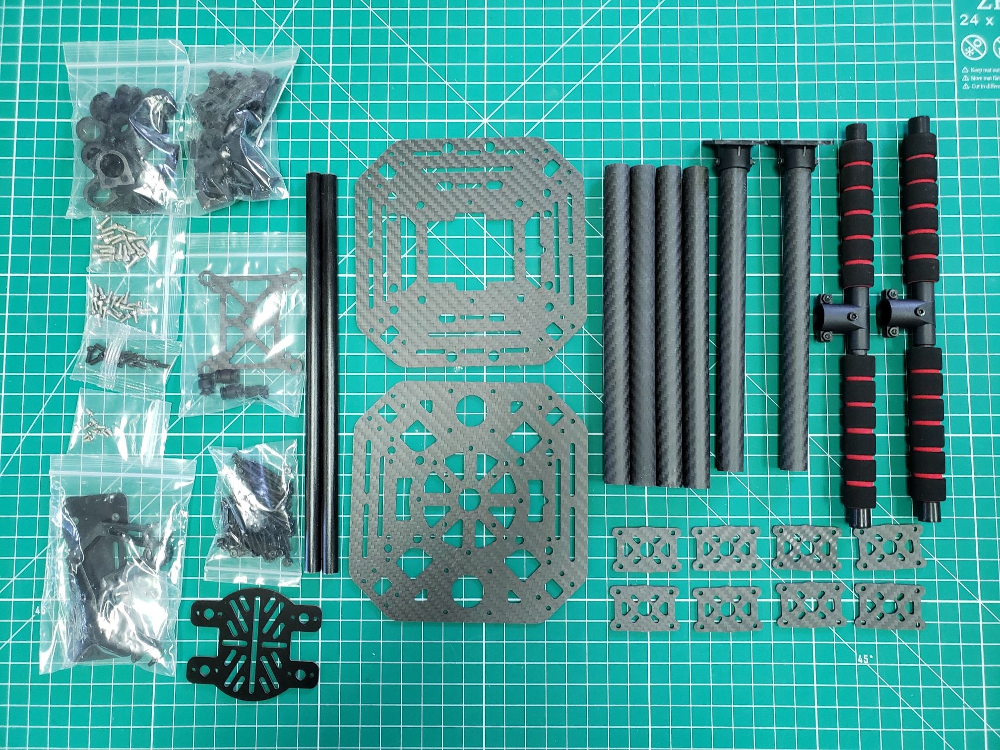
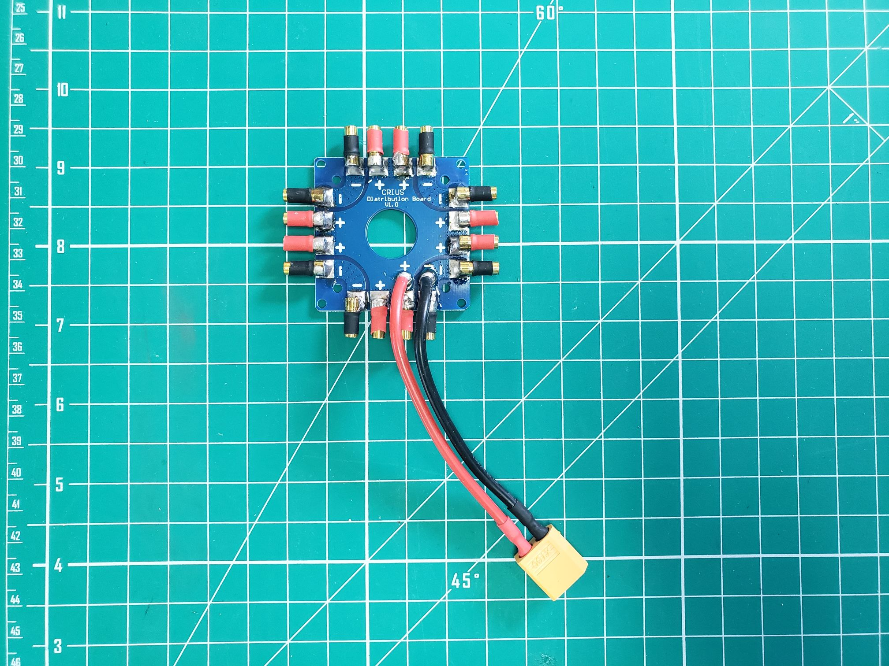
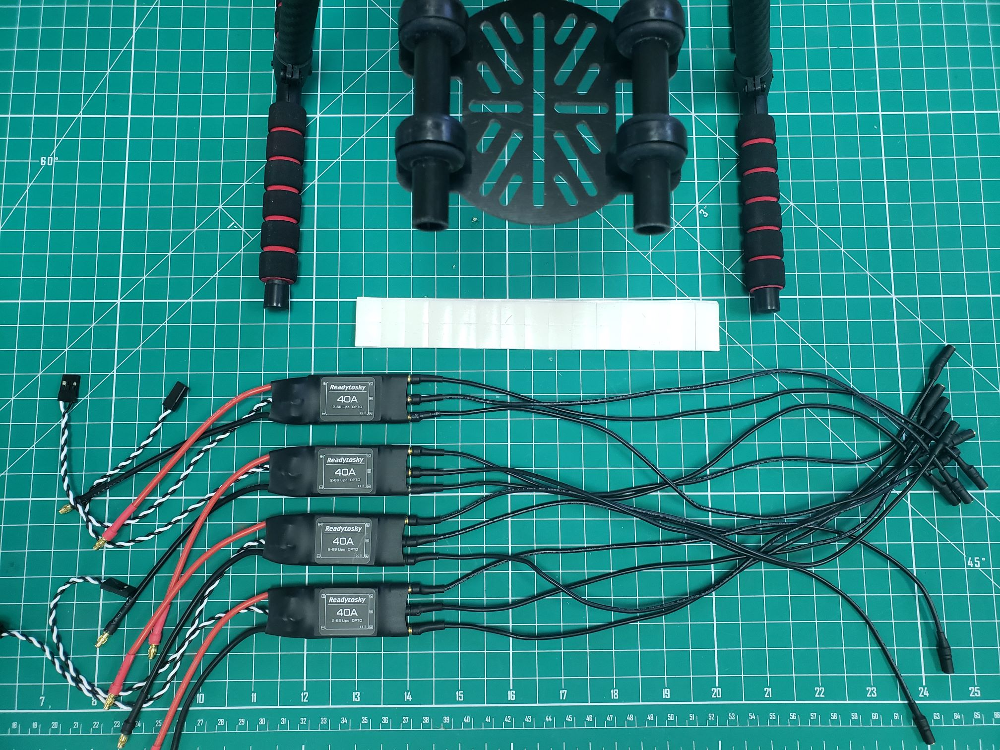
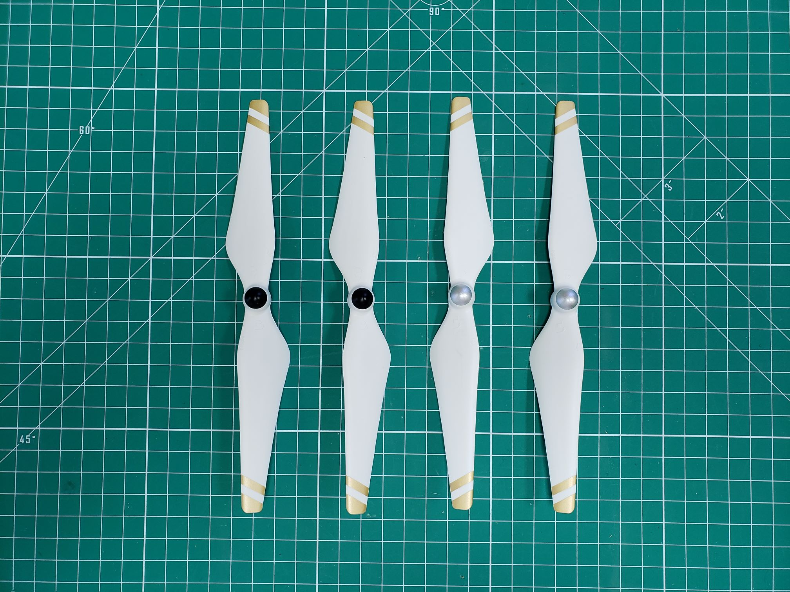

As you read through this page please be sure to refer to the
[glossary](),
which contains definitions of many of the components on this page.
The Bell VRC drone kit includes all of the components required to build your
own autonomous quadcopter. The kit provides a frame, motors, electronic speed
controllers, flight controller, and some additional peripherals.
This section will cover a majority of the components included for basic
assembly of the drone.

---

## Components in VRC Kit

Each of the following sections will explain the major components of the VRC kit
as well as provide photos for your reference. Be sure to lay out all of the
components in your kit and verify with the photos below to make sure nothing is missing.

## VRC Frame - Box 1

The VRC frame is the LJI X4 500 quadcopter frame and serves as the
body of the VRC drone. It is made out of carbon fiber parts and has a
vibration-damped mount for the flight controller (FC).
In an upcoming section, we'll cover how to assemble the frame.

- Frame size: 500 mm (diagonal), 200 mm (height)
- Weight: 475 g (without electronics and motors)

## VRC Flight Controller (FC) - Box 3

The VRC Flight Controller is provided by NXP and is the brain of the VRC drone.
It features NXP sensors and automotive grade components and it is fully supported
by [PX4 Autopilot software](https://docs.px4.io/en/).

The FC comes with a 3D-printed enclosure, which can be mounted on top of the
drone with double-sided tape. A microSD card is also included,
to which [logs](https://dev.px4.io/en/log/flight_log_analysis.html)
will be written during flight. Make sure to insert this SD card before you fly!

## FC Power Module - Box 3

The power module provides power to the FC and also includes voltage and current
sensors which allow the flight controller to keep track of the battery level.
The small white JST-GH connector provides power to the FC. The big black XT60
connectors go to the main battery and the power distribution board (PDB). The
PDB included with the frame kit should already have an XT60 connector installed.
Note that XT60 connectors are often yellow.

## Power Distribution Board (PDB) - Box 4

The PDB serves as the power hub for the VRC drone.
The FC power module and electronic speed controllers (ESCs)
will connect directly to the PDB. The yellow connector soldered
to the PDB is known as an XT60 connector.

## KDE 2315XF 965kV Brushless Motors - Box 4-1

The kit includes four brushless motors suitable for a quadcopter the size of
the VRC drone. Two motors will rotate in a clockwise (CW) direction, and
two in a counter-clockwise (CCW) direction. This allows the drone to fly
stable without rotating around its vertical axis. Motor rotation and propeller
orientation will be covered in detail at the end of this assembly guide.

## Readytosky 40A 2-6S OPTO Electronic Speed Controllers (ESCs) - Box 2

There are four ESCs or motor controllers included in the VRC kit.
The ESCs control the current to the motors based on output from the FC.
The motors are connected to the ESCs with three bullet connectors.

{}
The three bullet connectors can be connected in any order.
However, when a motor does not turn in the desired direction,
two of the three cables should be swapped. The motor will then turn
in the opposite direction. We will come back to this during the assembly instructions.
{}

The provided ESCs are able to handle currents up to 40 A (amps) continuously,
which should be more than enough when used with the included motors.
They support battery configurations between 2 and 6 cells in series.
The VRC kit includes a 4S battery provided by Venom Power.

## Self-locking 9.5" CW & CCW Propellers - Box 4

Included in the kit are also two clockwise (**CW**) turning propellers and two
counterclockwise (**CCW**) propellers, as well as one set of spares.
The intended direction of the propeller becomes clear from the shape of the propeller.
Looking at it from the side, it curves down towards the back of the propeller blade,
with the front being the side which "slices through the air first".
The direction of these self-tightening propellers is also easily recognized
by the color of the "integrated" nut. Propellers with a **black** nut are meant to
go **clockwise**, and propellers with a **silver** nut go **counterclockwise**.

## FlySky i6S Transmitter and Receiver - Box 2

For controlling the VRC drone, a radio controller is included.
This is also called a transmitter (TX). The TX has several switches
to which different actions and functions can be programmed.
Settings are changed with a touchscreen, which can also be set up to
show telemetry data. The receiver module (RX) connects directly to the FC.
An orange 3D printed component for mounting the antennas of the receiver is
included in the kit.

## Battery and Charger from Venom Power - Box 8

The power system of choice for the Bell VRC drone is a 5000mAh,
4S LiPo battery and charger provided by [Venom Power](https://www.venompower.com/).
Understanding how to handle, charge, and store LiPo batteries is
incredibly important. In an upcoming section,
just before the initial flight test, we will cover battery basics in detail.

